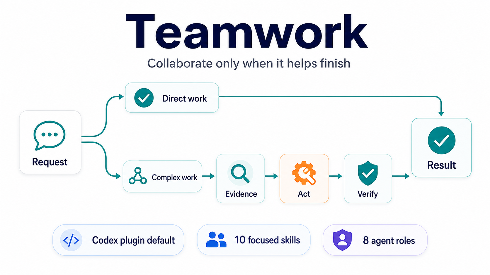

<p align="center">
  
</p>

<h1 align="center">Teamwork</h1>

<p align="center">
  <strong>Complex work needs collaboration, not process theater.</strong><br>
  Teamwork gives Codex, Cursor, and Claude Code a focused set of methods: move directly when the task is clear; bring in research, debugging, design, review, or goal loops only when they help finish the work.
</p>

<p align="center">
  <a href="https://github.com/JinPLu/Teamwork/releases"></a>
  <a href="LICENSE"></a>
  
</p>

<p align="center">
  <a href="README.md">中文</a> ·
  <a href="CHANGELOG.en.md">Changelog</a> ·
  <a href="CODEX.md">Codex guide</a> ·
  <a href="CURSOR.md">Cursor guide</a> ·
  <a href="CLAUDE.md">Claude Code guide</a>
</p>

---

## ✨ What it prevents

Teamwork is not another master router, and it is not a loop of “plan, review, test, repeat” instead of delivery. v4 removed the old Router / Execute path: clear authorized local implementation stays native to the host; Teamwork skills activate only when the task benefits from a distinct method.

| What you do not want | What Teamwork does |
| --- | --- |
| 🔁 Endless testing and review without delivery | Get the real result first; tests and review serve the changed path or a named risk gate. |
| 🧱 Workflow overhead for small work | Simple answers, small edits, and clear implementation requests stay on the fast host path. |
| 🕳️ Invented paths, ports, models, or state | Check project files, logs, config, official sources, and actual output. |
| ❓ Broad questions before inspection | Ask only about decisions that change result, scope, acceptance, or authority. |
| 🧑‍⚖️ Review replacing execution | Review is read-only by default and returns evidence-backed `ACCEPT`, `REVISE`, or `BLOCKED`. |

---

## 🧩 Ten skills, named when useful

Most of the time, describe the outcome directly. Name a skill when you want exact behavior.

| Skill | Use it when |
| --- | --- |
| 🔎 `$teamwork-research` | You need external facts, official docs, papers, market information, or cited sources. |
| 🗂️ `$teamwork-explore` | You need read-only local evidence from code, config, logs, tests, history, or artifacts. |
| 🧭 `$teamwork-design` | A product, architecture, workflow, or API choice still has a real tradeoff. |
| 🐞 `$teamwork-debug` | A failure has an unknown cause and needs reproduction before a safe fix. |
| 📝 `$teamwork-plan` | The direction is selected and needs owned steps, dependencies, acceptance, and stop conditions. |
| ✅ `$teamwork-review` | A plan, diff, artifact, or completion claim needs an independent check. |
| 🎯 `$teamwork-goal` | You explicitly want Codex to keep going until green, passing, or a budgeted target. |
| 🔥 `$grill-me` | You want key decisions challenged, or want the discussion saved or resumed. |
| 🧰 `$teamwork-init` | One repository needs project instructions, Teamwork memory entry points, or CodeGraph context. |
| 🔄 `$teamwork-update` | Global Teamwork skills, agents, policy, routing, or notifications need a refresh. |

Examples:

```text
Use $teamwork-research to read official docs and key papers, then give a cited recommendation.
Use $teamwork-debug to reproduce this CI failure, confirm the cause, and fix the same path.
Implement this change directly; verify only the affected path and stop when it works.
Use $teamwork-review to check this release for false success or stale wording.
Use $teamwork-goal to keep fixing until the named check passes, stopping only on a real blocker.
```

---

## 🚀 Quick start

### 🤖 Codex default: Marketplace plugin

```bash
codex plugin marketplace add JinPLu/Teamwork
codex plugin add teamwork-skill@teamwork
```

Start a new Codex task, then run:

```text
$teamwork-update
```

`$teamwork-update` explains the Codex agents, routing, managed global policy, notifications, and verified legacy cleanup it proposes, then waits for approval. Skills load directly from the plugin cache; they are not copied to `~/.agents/skills`, and Teamwork does not overwrite content whose ownership is uncertain.

### 🖥️ Cursor, Claude Code, or development checkout

```bash
git clone https://github.com/JinPLu/Teamwork.git
cd Teamwork
./install.sh all
./scripts/check-update.sh --readiness
```

Install only one host when preferred:

```bash
./install.sh cursor
./install.sh claude
./install.sh codex   # for development or manual Codex setup; normal Codex users use the plugin
```

Cursor also needs `./install.sh cursor-policy-copy`, followed by a manual paste into **Cursor Settings → Rules → User Rules**.

---

## 🧠 Codex agents and profiles

Full Codex setup installs eight custom agents: Researcher, Explorer, Debugger, Designer, Planner, Worker, Plan Reviewer, and Reviewer. They are used only when separate context or independent acceptance is worth it; the main task still owns scope, integration, and the final response.

| Profile | High-frequency execution roles | Design / plan review | Final review |
| --- | --- | --- | --- |
| `performance-first` | `gpt-5.5` / `high` | `gpt-5.6-sol` / `high` | `gpt-5.6-sol` / `max` |
| `cost-first` | `gpt-5.5` / `medium` | Designer uses `gpt-5.6-sol` / `medium`; Plan Reviewer uses `gpt-5.6-sol` / `high` | `gpt-5.6-sol` / `high` |

This split keeps frequent evidence, diagnosis, planning, and implementation loops fast, while leaving consequential choices and independent acceptance to the more conservative reviewer path.

---

## 🔄 Updates

Codex plugin update:

```bash
codex plugin marketplace remove teamwork
codex plugin marketplace add JinPLu/Teamwork
codex plugin add teamwork-skill@teamwork
```

Then start a new task and run `$teamwork-update`.

Checkout update:

```bash
git pull --ff-only
./install.sh all
./scripts/check-update.sh --readiness
```

For release reminders, open [JinPLu/Teamwork](https://github.com/JinPLu/Teamwork) and choose **Watch → Custom → Releases**. Notifications do not automatically update a local plugin or configuration.

---

## 🛡️ Safety boundaries

- Answers, research, design, planning, diagnostic debugging, and review are read-only by default; accepting a plan does not authorize implementation.
- The installer deletes only entries it can prove Teamwork generated. Never delete a whole `.agents`, `.codex`, `.cursor`, or `.claude` directory.
- After enabling Codex notifications, restart Codex and trust only Teamwork's `Stop` and `PermissionRequest` handlers in `/hooks`. Do not use trust-all.
- `./scripts/check-update.sh --readiness` checks Teamwork-managed files and configuration only; it cannot perform Cursor User Rules or hook-trust steps for the host.
- v4 has no legacy Router, Execute, or role aliases. Migration cleans up only old files whose Teamwork ownership is verified.

---

## 📚 Learn more

- [Changelog](CHANGELOG.en.md): user-visible changes and upgrade notes.
- [Codex](CODEX.md), [Cursor](CURSOR.md), and [Claude Code](CLAUDE.md): full platform setup and troubleshooting.
- [Repository architecture](docs/architecture.md): source layout, generated directories, dependency boundaries, and stable commands.
- [Contributing](CONTRIBUTING.md): change scope and verification requirements.
- [GitHub Issues](https://github.com/JinPLu/Teamwork/issues): report a problem or suggest an improvement.
