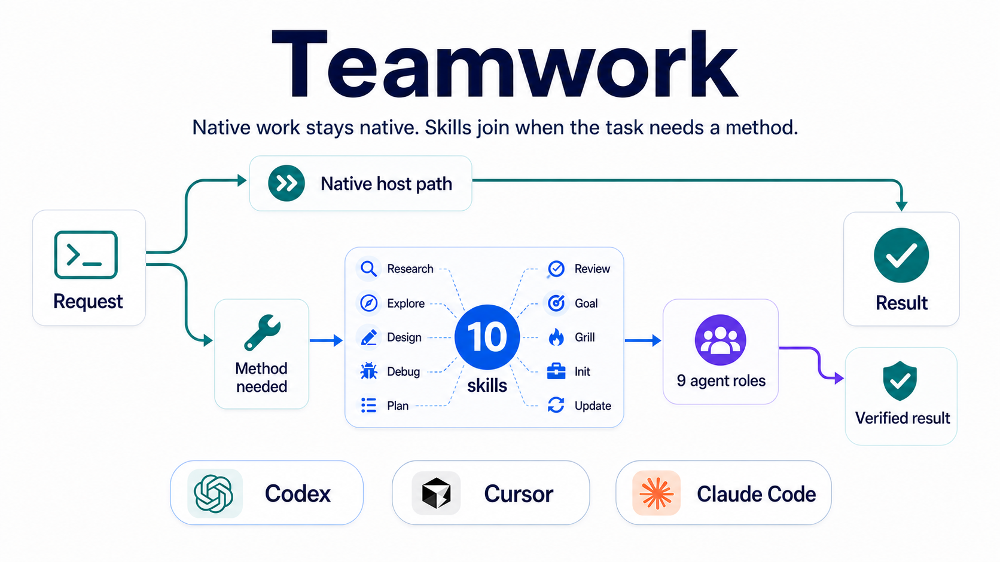

<p align="center">
  
</p>

<h1 align="center">Teamwork</h1>

<p align="center">
  <strong>A focused collaboration skill package for Codex, Cursor, and Claude Code.</strong><br>
  Teamwork does not take over ordinary local work: clear code inspection, file edits, and verification stay on the host's native path. It adds ten named methods when the task needs stronger constraints: external research, local evidence, decision design, unknown-cause debugging, planning, read-only review, long-running goals, project initialization, and global updates.
</p>

<p align="center">
  <a href="https://github.com/JinPLu/Teamwork/releases"></a>
  <a href="LICENSE"></a>
  
</p>

<p align="center">
  <a href="README.md">中文</a> ·
  <a href="CHANGELOG.en.md">Changelog</a> ·
  <a href="CODEX.md">Codex guide</a> ·
  <a href="CURSOR.md">Cursor guide</a> ·
  <a href="CLAUDE.md">Claude Code guide</a>
</p>

---

## ✨ What It Is

Teamwork is a set of on-demand collaboration methods, not a control layer that takes over the host. v4 removed the old Router / Execute path: clear authorized local implementation stays with Codex, Cursor, or Claude Code; Teamwork skills activate only when the task benefits from a distinct method.

| Layer | Responsibility |
| --- | --- |
| Native host path | Read local code, config, tests, logs, and artifacts; make clear authorized edits; run real verification. |
| Ten public skills | Provide bounded methods for research, evidence, design, debugging, planning, review, long-running goals, challenge discussions, project initialization, and global updates. |
| Nine optional agent roles | Researcher, Explorer, Debugger, Designer, Planner, Worker, Writer, Plan Reviewer, and Reviewer for Codex, Cursor, and Claude Code setups; the main task still owns scope, integration, and the final answer. |

## 🗃️ Documents and Persistence

In an initialized writable project, named Teamwork workflows persist reusable results by default as the matching artifact and register them in `docs/teamwork/index.json`; explicit `no files`, off-record, read-only, or no-write instructions override that default. Ordinary clarification or chat, one-off native work outside a Teamwork workflow, and clear code implementation requests are not forced to create an extra workflow artifact just because Teamwork is installed.

Writer works only from a frozen bounded brief supplied by Root or a strong role. It may draft, rewrite, organize, summarize, translate, and polish standalone documents or runtime artifacts, but must not research, invent or change facts, citations, decisions, authority, status, or acceptance conclusions, and must not self-accept. Code-coupled comments, docstrings, tests, schemas, manifests, machine config, and inline config text stay with the Worker or implementation owner.

Grill, Design, and Goal use their own specialized transactions. Research, Debug, Plan, Review, and mutating Init/Update use the generic artifact transaction. Explore creates no standalone report; its evidence is folded into the artifact or answer that consumes it.

| Workflow | Persisted by default? | Main artifact | Later consumption |
| --- | --- | --- | --- |
| Ordinary clarification or chat / one-off native work | No | No forced artifact | Continue from the conversation and native host context. |
| Grill | Yes, unless no files/off-record/read-only/no-write | Controlled discussion | Resume the major discussion and its frontier/current_batch. |
| Research | Yes | Research | Supplies cited evidence for Design, Plan, Review, docs, or final answers. |
| Design | Yes; persistence is not acceptance | Controlled design state with `pending`, `accepted`, or `blocked` acceptance | Only `accepted` may enter Plan; `pending` / `blocked` remain design evidence, while legacy v1/v2 records are read compatibly as `accepted`. |
| Plan | Yes | Canonical plan | Root/Worker execute by owner, path, verification, and stop rules. |
| Debug | Yes | Diagnosis/report | Root/Worker continue from the cause, fix boundary, and same-path proof. |
| Review | Yes; persistence is not acceptance | Verdict/conclusion | Root uses `ACCEPT` / `REVISE` / `BLOCKED` to close or repair. |
| Goal | Yes | Existing entry/attempt/status | Later turns resume from objective, budget, success signal, and blocker state. |
| Mutating Init / Update | Yes | Receipt | Supports readiness checks, troubleshooting, and user review. |
| Explore | No | No standalone report | Local evidence is folded into the consuming Design, Plan, Debug, Review, Goal, or answer. |

| Situation | Recommended use |
| --- | --- |
| The local change is already clear | Describe the outcome directly; no Teamwork skill is needed. |
| You need current external facts, official docs, papers, or citations | Use `$teamwork-research`. |
| You need read-only local evidence from code, config, logs, tests, history, or artifacts | Use `$teamwork-explore`. |
| A product, architecture, workflow, or API direction is unsettled | Describe the choice directly; Teamwork Design selects the ordinary challenge or adversarial search. Use `$grill-me` when key decisions should be questioned first. |
| A failure has an unknown cause and cannot be fixed safely yet | Use `$teamwork-debug`. |
| The controlled Design is `accepted` and needs executable steps | Use `$teamwork-plan`. |
| A plan, diff, artifact, or completion claim needs independent acceptance | Use `$teamwork-review`. |
| You explicitly want work to continue until green, passing, or a budgeted target | Use `$teamwork-goal`. |
| You need to initialize one project or refresh global installation | Use `$teamwork-init` and `$teamwork-update`, respectively. |

## 🛡️ What It Keeps Out

| What you do not want | What Teamwork does |
| --- | --- |
| 🔁 Endless testing and review without delivery | Get the real result first; tests and review serve the changed path or a named risk gate. |
| 🧱 Workflow overhead for small work | Simple answers, small edits, and clear implementation requests stay on the fast host path. |
| 🕳️ Invented paths, ports, models, or state | Check project files, logs, config, official sources, and actual output. |
| ❓ Broad questions before inspection | Show the global decision map first; batch only independent key decisions, and ask dependent decisions in later turns. |
| 🧑‍⚖️ Review replacing execution | Review is read-only by default and returns evidence-backed `ACCEPT`, `REVISE`, or `BLOCKED`. |

---

## 🧩 Ten skills, named when useful

Most of the time, describe the outcome directly. Name a skill when you want exact behavior.

| Skill | Use it when |
| --- | --- |
| 🔎 `$teamwork-research` | You need external facts, official docs, papers, market information, or cited sources. |
| 🗂️ `$teamwork-explore` | You need read-only local evidence from code, config, logs, tests, history, or artifacts. |
| 🧭 `$teamwork-design` | A product, architecture, workflow, or API choice still has a real tradeoff; the model selects the ordinary challenge or budgeted adversarial search, with `adversarial` / `standard` as overrides. |
| 🐞 `$teamwork-debug` | A failure has an unknown cause and needs reproduction before a safe fix. |
| 📝 `$teamwork-plan` | The direction is selected and needs owned steps, dependencies, acceptance, and stop conditions. |
| ✅ `$teamwork-review` | A plan, diff, artifact, or completion claim needs an independent check. |
| 🎯 `$teamwork-goal` | You explicitly want Codex to keep going until green, passing, or a budgeted target. |
| 🔥 `$grill-me` | You want key decisions challenged, or want the discussion saved or resumed. |
| 🧰 `$teamwork-init` | One repository needs project instructions, Teamwork memory entry points, or CodeGraph context. |
| 🔄 `$teamwork-update` | Global Teamwork skills, agents, policy, routing, or notifications need a refresh. |

Examples:

```text
Use $teamwork-research to read official docs and key papers, then give a cited recommendation.
This public API could be synchronous, queued, or hybrid. A wrong choice forces an expensive migration on every client, and the latency and reliability evidence conflicts. Help me decide.
Use $teamwork-debug to reproduce this CI failure, confirm the cause, and fix the same path.
Implement this change directly; verify only the affected path and stop when it works.
Use $teamwork-review to check this release for false success or stale wording.
Use $teamwork-goal to keep fixing until the named check passes, stopping only on a real blocker.
```

---

## 🚀 Quick start

### 🤖 Codex default: Marketplace plugin

```bash
codex plugin marketplace add JinPLu/Teamwork
codex plugin add teamwork-skill@teamwork
```

Start a new Codex task, then run:

```text
$teamwork-update
```

`$teamwork-update` explains the Codex agents, routing, managed global policy, notifications, and verified legacy cleanup it proposes, then waits for approval. Skills load directly from the plugin cache; they are not copied to `~/.agents/skills`, and Teamwork does not overwrite content whose ownership is uncertain.

### 🖥️ Cursor, Claude Code, or development checkout

```bash
git clone https://github.com/JinPLu/Teamwork.git
cd Teamwork
./install.sh all
./scripts/check-update.sh --readiness
```

Install only one host when preferred:

```bash
./install.sh cursor
./install.sh claude
./install.sh codex   # for development or manual Codex setup; normal Codex users use the plugin
```

Cursor also needs `./install.sh cursor-policy-copy`, followed by a manual paste into **Cursor Settings → Rules → User Rules**.

---

## 🧠 Codex agents and profiles

Full Codex setup installs nine custom agents: Researcher, Explorer, Debugger, Designer, Planner, Worker, Writer, Plan Reviewer, and Reviewer. They are used only when separate context, standalone document writing, or independent acceptance is worth it; the main task still owns scope, integration, and the final response. Writer uses a simple model for standalone project/product docs, README/guide/architecture/change/release notes, and Teamwork runtime artifacts; code, code comments, docstrings, tests, schemas, manifests, machine config, and inline config text remain with implementation owners.

| Profile | High-frequency execution roles | Document Writer | Design / plan review | Final review |
| --- | --- | --- | --- | --- |
| `performance-first` | `gpt-5.5` / `high` | `gpt-5.5` / `low` | `gpt-5.6-sol` / `high` | `gpt-5.6-sol` / `max` |
| `cost-first` | `gpt-5.5` / `medium` | `gpt-5.5` / `low` | Designer uses `gpt-5.6-sol` / `medium`; Plan Reviewer uses `gpt-5.6-sol` / `high` | `gpt-5.6-sol` / `high` |

This split keeps frequent evidence, diagnosis, planning, and implementation loops fast, moves standalone prose to the simple Writer, and leaves consequential choices and independent acceptance to the more conservative reviewer path. Writer may organize, rewrite, summarize, translate, and polish expression, but must not research, invent facts, change citations, decisions, permissions, status, acceptance, or self-accept.

---

## 🔄 Updates

Codex plugin update:

```bash
codex plugin marketplace remove teamwork
codex plugin marketplace add JinPLu/Teamwork
codex plugin add teamwork-skill@teamwork
```

Then start a new task and run `$teamwork-update`.

Checkout update:

```bash
git pull --ff-only
./install.sh all
./scripts/check-update.sh --readiness
```

For release reminders, open [JinPLu/Teamwork](https://github.com/JinPLu/Teamwork) and choose **Watch → Custom → Releases**. Notifications do not automatically update a local plugin or configuration.

---

## 🛡️ Safety boundaries

- Research, Design, Plan, diagnostic Debug, and Review do not authorize candidate edits or external effects; reusable results from named workflows still persist by default under the matrix above, and accepting a Plan does not authorize implementation.
- Design auto-selects adversarial only when at least two viable directions remain and costly or irreversible error or conflicting evidence makes one ordinary challenge inadequate; merely saying “high-risk” or “complex” does not trigger it. The model states why and uses default `B=3` without another confirmation; `adversarial` / `standard` remain force and disable overrides. Every actual hypothesis receives two fresh critics and two new final auditors must both pass. Design v3 always records `acceptance: pending`, `accepted`, or `blocked`; unproven isolation or closure can remain `pending` or become `blocked`, never Plan-ready. Persistence is not acceptance, and only `accepted` may enter Plan.
- Ordinary clarification does not trigger Grill or persistence. Once Grill is named or entered, an existing Grill is resumed, or an independently major boundary invokes it, the specialized transaction updates only `docs/teamwork/discussion/current.md` by default unless `no files`, off-record, read-only, or no-write overrides. New records use `frontier` / `current_batch` state and are not mirrored into ordinary memory.
- The installer deletes only entries it can prove Teamwork generated. Never delete a whole `.agents`, `.codex`, `.cursor`, or `.claude` directory.
- After enabling Codex notifications, restart Codex and trust only Teamwork's `Stop` and `PermissionRequest` handlers in `/hooks`. Do not use trust-all.
- `./scripts/check-update.sh --readiness` checks Teamwork-managed files and configuration only; it cannot perform Cursor User Rules or hook-trust steps for the host.
- v4 has no legacy Router, Execute, or role aliases. Migration cleans up only old files whose Teamwork ownership is verified.

---

## 📚 Learn more

- [Changelog](CHANGELOG.en.md): user-visible changes and upgrade notes.
- [Codex](CODEX.md), [Cursor](CURSOR.md), and [Claude Code](CLAUDE.md): full platform setup and troubleshooting.
- [Repository architecture](docs/architecture.md): source layout, generated directories, dependency boundaries, and stable commands.
- [Contributing](CONTRIBUTING.md): change scope and verification requirements.
- [GitHub Issues](https://github.com/JinPLu/Teamwork/issues): report a problem or suggest an improvement.
