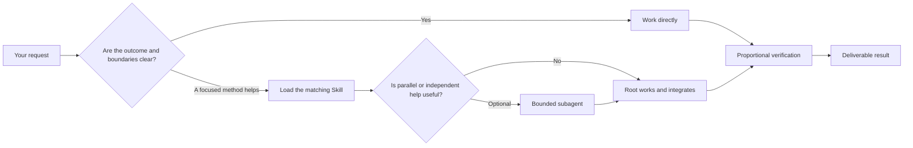

<p align="center">
  
</p>

<h1 align="center">Teamwork</h1>

<p align="center">
  <strong>Less workflow for Codex. More work actually finished.</strong><br>
  Clear, authorized work runs directly. A focused method joins only when the task genuinely needs one.
</p>

<p align="center">
  <a href="https://github.com/JinPLu/Teamwork/releases"></a>
  <a href="LICENSE"></a>
  
  
  
</p>

<p align="center">
  <a href="README.md">中文</a> ·
  <a href="CHANGELOG.en.md">Changelog</a> ·
  <a href="CODEX.md">Codex</a> ·
  <a href="docs/architecture.md">Architecture</a> ·
  <a href="https://github.com/JinPLu/Teamwork/issues">Feedback</a>
</p>

---

> [!TIP]
> **You do not need to memorize eight Skills.** Describe the result directly most of the time. Name a Skill only when you genuinely need discussion, deep research, unknown-cause debugging, planning, or review: Codex uses `$teamwork-*`; Cursor / Claude Code use `/teamwork-*`.

## 🚀 Start in one minute

Install from the Codex Marketplace:

```bash
codex plugin marketplace add JinPLu/Teamwork
codex plugin add teamwork-skill@teamwork
```

Start a new Codex task, then run:

```text
$teamwork-update
```

Now ask for the outcome directly:

```text
Change the login timeout, verify only the real affected path, and stop when it works.
```

When the outcome and approach are clear, Teamwork does not manufacture a workflow, project record, or readiness gate first. To shape the direction together:

```text
Use $teamwork-collaborate to compare synchronous, queued, and hybrid approaches. Recommend one, then ask only what could change the choice.
```

## ✨ Why Teamwork

| | What you get | What it feels like |
| --- | --- | --- |
| ⚡ | **Clear work runs directly** | Ordinary edits, local inspection, narrow lookups, and known-cause fixes need no preflight. |
| 🧭 | **Your boundaries remain yours** | “Continue” does not turn an Agent's own SHA-256, receipt, audit-test, or other defensive proposal into your requirement. |
| 🧰 | **Methods join on demand** | Discussion, research, debugging, planning, review, and persistence appear only when the request matches. |
| 🤝 | **Subagents are optional collaborators** | They join when parallel or independent work is useful; missing optional roles do not block ordinary work. |
| ✅ | **Completion follows the real outcome** | Verification matches the claim instead of substituting versions, markers, or test counts for the result. |

## 🛣️ How work flows


```mermaid
flowchart LR
    R["Your request"] --> C{"Are the outcome and boundaries clear?"}
    C -->|"Yes"| D["Work directly"]
    C -->|"A focused method helps"| S["Load the matching Skill"]
    S --> A{"Is parallel or independent help useful?"}
    A -->|"Optional"| G["Bounded subagent"]
    A -->|"No"| I["Root works and integrates"]
    G --> I
    D --> V["Proportional verification"]
    I --> V
    V --> O["Deliverable result"]
```

There is no Router, mandatory stage chain, or automatic Update detour. Root always owns user dialogue, integration, and the final result.

## 🧭 Use the method you actually need

| What is missing | Skill | Result |
| --- | --- | --- |
| 💬 An acceptable direction | `$teamwork-collaborate` | Compare options and trade-offs, then converge on a direction you accept. |
| 🔎 Deep external evidence | `$teamwork-research` | Synthesize claims, contradictions, and conclusions across primary and reliable sources. |
| 🐞 The cause of a failure | `$teamwork-debug` | Start from the real failure, find the cause, then make an authorized narrow repair. |
| 📝 Executable steps | `$teamwork-plan` | Turn a selected direction into clear outcomes, dependencies, verification, and stop conditions. |
| ✅ Judgment on a stable candidate | `$teamwork-review` | Read the actual code, document, plan, or artifact and return an evidence-backed verdict. |
| 🎯 Progress to a success signal | `$teamwork-goal` | Continue only when explicitly requested, until success is verified or a real blocker appears. |
| 🧰 Lightweight project guidance | `$teamwork-init` | Maintain one concise, idempotent `AGENTS.md` managed block. |
| 🔄 Install inspection or refresh | `$teamwork-update` | Refresh the Codex Teamwork installation by default. |

## 🤝 Eight optional Agent roles

Researcher, Explorer, Debugger, Challenger, Planner, Reviewer, Worker, and Writer are bounded helpers, not a pipeline every task must traverse. Cursor and Claude Code install 7 roles and use the host's built-in Explore; Codex keeps Explorer. Writer is a low-cost, non-blocking recorder reusable across Skills: at semantic checkpoints it turns owner-certified changes into readable Markdown under `docs/teamwork/` and never changes the owner's facts, decisions, or conclusions. If Writer is unavailable, Root writes the same template and marks that Root fallback in the closeout; silently skipping remains a violation.

- Root delegates only when parallel investigation, independent judgment, or a clean division of work is useful.
- A handoff carries the objective, owned scope, settled constraints, available evidence, and requested return.
- Reviewer stays read-only and never implements its own findings. Writer failure does not block the main work, and Root still confirms what enters the mainline.
- Teamwork children use Standard by default. Fast on the parent does not automatically multiply child cost unless you explicitly accelerate the children too.
- When Cursor and Claude both have same-named Skill copies, which copy wins is not guaranteed; keep both in sync on install.

## 🗃️ Six readable document types

When a focused method reaches a semantic checkpoint, prefer Writer to maintain
plain Markdown under `docs/teamwork/`; if Writer is unavailable, Root writes the
same template and marks Root fallback. Each document carries both a **current
synthesis** and an append-only **chronological history**, so it is quick to
read without hiding how the conclusion changed. Default filenames are
`<YYYY-MM-DD>-<slug>.md`; reuse the path for the same stable identity.

| Document | What it records |
| --- | --- |
| 💬 Discussion | Options, trade-offs, settled choices, and open decisions. |
| 🔎 Research | External evidence, contradictions, synthesized conclusions, confidence, and stop basis. |
| 🐞 Debug | Failure boundary, hypotheses, root cause, repair, and same-path verification. |
| 📝 Plan | Selected-direction steps, owners, dependencies, verification, and stop conditions. |
| ✅ Review | Stable candidate, direct evidence, findings, and verdict. |
| 📌 Report | Status, outcomes, and blockers from Goal, Init, Update, or execution work. |

Reusing Writer across Skills reuses only the Agent lifecycle; it does not let one Skill take ownership of another Skill's meaning. Documents require no Case, schema, JSON index, migration, or readiness gate, and no document is needed when nothing reusable changed.

## 📋 Prompts you can copy

```text
# Choose a direction together
Use $teamwork-collaborate to compare three onboarding directions. Recommend one and ask only questions that could change the choice.

# Research deeply
Use $teamwork-research to check official sources and key papers, resolve contradictory evidence, and return traceable conclusions.

# Debug an unknown cause
Use $teamwork-debug to reproduce this CI failure, confirm the cause, then make the smallest repair and verify the same path.

# Build an execution plan
Use $teamwork-plan to turn the selected migration direction into outcomes, owners, dependencies, verification, and stop conditions. Do not execute it.

# Review independently
Use $teamwork-review to check whether this diff meets the requirements, focusing on false success, missed paths, and stale documentation.

# Persist to completion
Use $teamwork-goal to continue until the named check passes; stop only for a real blocker.
```

## 🔄 Update and project setup

Refresh the Marketplace version:

```bash
codex plugin marketplace remove teamwork
codex plugin marketplace add JinPLu/Teamwork
codex plugin add teamwork-skill@teamwork
```

Restart Codex, open a new task, and run `$teamwork-update`.

To add only lightweight Teamwork guidance to one project:

```bash
./install.sh --project-root /absolute/project/path init-project
```

This only adds or refreshes one `AGENTS.md` managed block. It creates no Case, index, schema, migration state, or project runtime.

<details>
<summary><strong>Development checkout, compatibility adapters, and verification</strong></summary>

```bash
git clone https://github.com/JinPLu/Teamwork.git
cd Teamwork
./install.sh --help
./scripts/validate.sh
./scripts/check-update.sh --readiness
```

Codex is the supported and release-qualified runtime (invoke Skills with `$name`). Cursor and Claude Code adapters remain for explicit compatibility development (invoke Skills with `/name`); they do not participate in Codex readiness or block ordinary work. When dual skill roots both have same-named copies, which wins is not guaranteed—keep both in sync on install.

`./scripts/validate.sh` runs the fast core smoke. Explicit release preparation uses `./scripts/validate.sh --release`. Readiness reports installation state only; it never authorizes or blocks another task.

</details>

## 📚 Learn more

- [Changelog](CHANGELOG.en.md): what each release actually changed.
- [Codex guide](CODEX.md): installation, configuration, and troubleshooting.
- [Architecture](docs/architecture.md): boundaries between native work, Skills, Agents, and installation.
- [Contributing](CONTRIBUTING.md): canonical owners and verification commands.
- [Cursor](CURSOR.md) / [Claude Code](CLAUDE.md): compatibility-development adapters.

License: [MIT](LICENSE)
