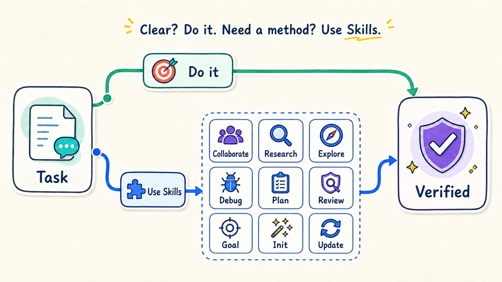

<p align="center">
  
</p>

<h1 align="center">Teamwork</h1>

<p align="center">
  <strong>Let Codex, Cursor, and Claude Code work directly when they should, and bring in a method when the task needs one.</strong><br>
  Teamwork provides nine on-demand skills for collaborative convergence, external research, local evidence, unknown-cause debugging, planning, review, persistent goals, project initialization, and global updates.
</p>

<p align="center">
  <a href="https://github.com/JinPLu/Teamwork/releases"></a>
  <a href="LICENSE"></a>
  
</p>

<p align="center">
  <a href="README.md">中文</a> ·
  <a href="CHANGELOG.en.md">Changelog</a> ·
  <a href="CODEX.md">Codex</a> ·
  <a href="CURSOR.md">Cursor</a> ·
  <a href="CLAUDE.md">Claude Code</a>
</p>

---

> [!TIP]
> **You do not need to memorize nine skills first.** Describe the outcome directly most of the time. Name a `$teamwork-*` skill only when you want exact control over the method.

## 🚀 Start in one minute

### Codex: use the Marketplace plugin

```bash
codex plugin marketplace add JinPLu/Teamwork
codex plugin add teamwork-skill@teamwork
```

Start a new Codex task and run:

```text
$teamwork-update
```

It explains the agents, routing, global policy, and notifications it proposes before waiting for approval. Restart Codex when configuration finishes. If notifications are enabled, trust Teamwork's `Stop` and `PermissionRequest` handlers individually in `/hooks`; do not use trust-all.

To add project instructions, Teamwork memory, and CodeGraph context to a repository, run this from that repository:

```text
Use $teamwork-init to initialize this project.
```

You can now start with a direct request:

```text
Implement this validation change directly, verify the affected path, and stop when it works.
```

Clear local work like this needs no Teamwork skill. When you want to settle the direction first, try:

```text
Use $teamwork-collaborate to work through the onboarding with me. Give me a recommendation first, then ask the most useful next question.
```

<details>
<summary><strong>Cursor, Claude Code, or a development checkout</strong></summary>

```bash
git clone https://github.com/JinPLu/Teamwork.git
cd Teamwork
./install.sh all
./scripts/check-update.sh --readiness
```

Install one host when preferred:

```bash
./install.sh cursor
./install.sh claude
./install.sh codex   # development or manual Codex setup only
```

Cursor also needs `./install.sh cursor-policy-copy`, followed by a paste into **Cursor Settings → Rules → User Rules**. See the [Cursor guide](CURSOR.md) and [Claude Code guide](CLAUDE.md) for details.

</details>

## 🧭 Which skill should I use?

Ask what is missing right now, not how complicated the task looks.

| What you are missing | Use | What it does |
| --- | --- | --- |
| An acceptable direction | 💬 `$teamwork-collaborate` | Dialogue, brainstorm, grill, stress-test, or converge on an unsettled product, architecture, workflow, or API direction. |
| External or current facts | 🔎 `$teamwork-research` | Read official sources, papers, market, or ecosystem evidence; compare multiple sources or provide citations. |
| Read-only local evidence | 🗂️ `$teamwork-explore` | Inspect code, config, logs, tests, history, or artifacts without changing the project. |
| The cause of a real failure | 🐞 `$teamwork-debug` | Reproduce the failure, discriminate among hypotheses, and establish a safe repair boundary. |
| Executable steps | 📝 `$teamwork-plan` | Turn a selected direction into owned steps with dependencies, acceptance, and stop conditions. |
| Independent acceptance | ✅ `$teamwork-review` | Check a plan, diff, artifact, or completion claim against direct evidence. |
| Persistent progress | 🎯 `$teamwork-goal` | Keep fixing until green, monitor through completion, or work within an explicit budget. |
| Project-level setup | 🧰 `$teamwork-init` | Initialize, audit, or repair one repository's instructions, memory, routing, and CodeGraph context. |
| Global installation setup | 🔄 `$teamwork-update` | Check or refresh global skills, agents, policy, routing, and notifications. |

Natural language can activate the same methods, such as “brainstorm this with me,” “inspect local evidence without editing,” or “keep fixing until the test passes.” Skill selection is still model behavior. Name the skill when exact selection matters.

## 🛣️ The four most common paths

### 1. The outcome and change are clear

```text
Change the login timeout logic directly. Verify only the related tests and real login path.
```

**Path:** native host inspection → edit → verification.

No Router, Execute, or other Teamwork skill is needed.

### 2. The direction is still open

```text
Use $teamwork-collaborate to compare synchronous, queued, and hybrid API designs and help me converge on an acceptable direction.
```

**Path:** Collaborate → accepted direction → Plan when useful → native implementation.

Discussion, planning, or acceptance alone does not authorize code changes.

### 3. There is a failure, but the cause is unknown

```text
Use $teamwork-debug to reproduce this CI failure, confirm the cause, then fix and verify the same path.
```

**Path:** Debug reproduction and diagnosis → native repair → rerun the failing path.

If the cause and narrow repair are already clear, fix it directly instead.

### 4. A decision depends on external facts

```text
Use $teamwork-research to read official documentation and recent changes, then give me a sourced compatibility recommendation.
```

**Path:** Research → sourced conclusion; enter Collaborate only if multiple real directions remain.

Local code and log evidence belongs to Explore, not Research.

Review can be added as an explicit independent acceptance gate. Goal can wrap any execution path that genuinely needs persistent progress. Neither is a default step for every task.

## 📋 Copy-ready prompts

```text
# Think together
Use $teamwork-collaborate to brainstorm a lower-maintenance release flow with me. Synthesize the current state and real options first, then ask the most useful question.

# Research external evidence
Use $teamwork-research to read only official sources and key papers, compare the options, and provide traceable citations.

# Inspect local evidence
Use $teamwork-explore to map the authentication flow, related configuration, and tests. Tell me the real change boundary without editing files.

# Diagnose a failure
Use $teamwork-debug to reproduce this error, discriminate among the likely causes, then fix and verify the same path once confirmed.

# Write a plan
Use $teamwork-plan to turn the selected migration direction into owned steps with dependencies, acceptance criteria, and stop conditions. Do not execute it.

# Review independently
Use $teamwork-review to check this diff against the requirements, focusing on false success, missed paths, and stale documentation.

# Persist to completion
Use $teamwork-goal to keep fixing until the named check passes. Stop only for a genuine blocker.
```

## 🧩 What skills, agents, and the host each own

| Layer | Responsibility | Do new users operate it directly? |
| --- | --- | --- |
| Native host path | Clear local inspection, edits, and verification. | Yes. Describe the outcome directly. |
| Nine public skills | Constrain the method when a task needs one. | Optional. Name one when exact selection matters. |
| Nine agent roles | Researcher, Explorer, Debugger, Designer, Planner, Worker, Writer, Plan Reviewer, and Reviewer for worthwhile independent work. | Usually no. The main task owns dispatch, integration, and the final response. |

Teamwork is not a control layer and does not turn every small request into a workflow. It supplements the host instead of replacing Codex, Cursor, or Claude Code tools, permissions, and execution paths.

## 🗃️ Persistence and safety boundaries

- In an initialized writable project, named Teamwork workflows save reusable checkpoints or results by default. One-shot explanations, small edits, and ordinary local work do not force a document.
- Explicit `no files`, off-record, read-only, or no-write instructions override default persistence.
- Research, Collaborate, Plan, diagnostic Debug, and Review do not automatically authorize code edits or external effects. Accepting a plan does not authorize execution.
- Freshly initialized projects use v2 case bundles to keep one matter's collaboration, evidence, plan, review, Goal, and result under `docs/teamwork/cases/`. In existing legacy-v1 projects, Collaborate keeps its one-file record at `docs/teamwork/collaborate/current.md`, while Goal retains its dedicated route and the generic artifact transaction handles other durable artifacts.
- Any `cutover` must be explicit and one-way. Installing or updating Teamwork does not migrate, rewrite, or delete existing project documents.
- Teamwork also does not remove configuration whose ownership it cannot prove.

For persistence internals, agent profiles, adversarial Collaborate, and platform limits, see [Codex](CODEX.md), [Cursor](CURSOR.md), [Claude Code](CLAUDE.md), and [repository architecture](docs/architecture.md).

## 🔄 Updates

Codex plugin:

```bash
codex plugin marketplace remove teamwork
codex plugin marketplace add JinPLu/Teamwork
codex plugin add teamwork-skill@teamwork
```

Then start a new task and run `$teamwork-update`.

Checkout:

```bash
git pull --ff-only
./install.sh all
./scripts/check-update.sh --readiness
```

For release notifications, open [JinPLu/Teamwork](https://github.com/JinPLu/Teamwork) and choose **Watch → Custom → Releases**.

## 📚 Learn more

- [Changelog](CHANGELOG.en.md): user-visible changes and upgrade notes.
- [Codex](CODEX.md), [Cursor](CURSOR.md), and [Claude Code](CLAUDE.md): platform installation, configuration, and troubleshooting.
- [Repository architecture](docs/architecture.md): source layout, generated directories, dependency boundaries, and stable commands.
- [Contributing](CONTRIBUTING.md): change scope and verification requirements.
- [GitHub Issues](https://github.com/JinPLu/Teamwork/issues): report a problem or suggest an improvement.
