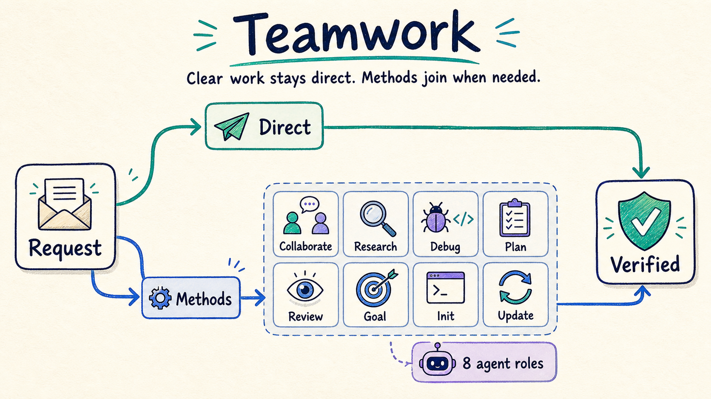

<p align="center">
  
</p>

<h1 align="center">Teamwork</h1>

<p align="center">
  <strong>Let AI work directly when it should, and bring in a method only when the task needs one.</strong><br>
  AI/human collaboration Skills for Codex, Cursor, and Claude Code, with less ceremony, clearer boundaries, and more credible results.
</p>

<p align="center">
  <a href="https://github.com/JinPLu/Teamwork/releases"></a>
  <a href="LICENSE"></a>
  
</p>

<p align="center">
  <a href="README.md">中文</a> ·
  <a href="CHANGELOG.en.md">Changelog</a> ·
  <a href="CODEX.md">Codex</a> ·
  <a href="CURSOR.md">Cursor</a> ·
  <a href="CLAUDE.md">Claude Code</a> ·
  <a href="docs/architecture.md">Architecture</a>
</p>

---

> [!TIP]
> **You do not need to memorize eight Skills.** Describe the outcome directly most of the time. Name a `$teamwork-*` Skill only when you want precise control over discussion, research, debugging, planning, or review.

## 🚀 Start in one minute

### Codex: use the Marketplace plugin

```bash
codex plugin marketplace add JinPLu/Teamwork
codex plugin add teamwork-skill@teamwork
```

Start a new Codex task and run:

```text
$teamwork-update
```

The first setup lets you choose `performance-first` or `cost-first`, then decide independently whether to enable managed CodeGraph and the local GPU Broker. Skills, Agents, routing, and global policy install whether or not those optional capabilities are enabled.

Now ask for the result directly:

```text
Implement this validation change, verify the real affected path, and stop when it works.
```

When the outcome and boundary are clear, Teamwork does not manufacture a workflow first. If you want to shape the direction together, try:

```text
Use $teamwork-collaborate to compare three onboarding directions with me. Recommend first, then ask only what could change the choice.
```

To create current-format project instructions and Teamwork documents in a new repository:

```text
Use $teamwork-init to initialize this project.
```

<details>
<summary><strong>Cursor, Claude Code, or a development checkout</strong></summary>

```bash
git clone https://github.com/JinPLu/Teamwork.git
cd Teamwork
./install.sh all
./scripts/check-update.sh --readiness
```

Install one host when preferred:

```bash
./install.sh cursor
./install.sh claude
./install.sh codex   # development or manual Codex setup only
```

Choose the lower-cost profile with:

```bash
./install.sh all --profile cost-first
```

Cursor also needs `./install.sh cursor-policy-copy`, followed by a paste into **Cursor Settings → Rules → User Rules**. See the [Cursor guide](CURSOR.md) and [Claude Code guide](CLAUDE.md) for platform details.

</details>

## 🧭 Use what is missing now

| What you are missing | Use | What it solves |
| --- | --- | --- |
| An acceptable direction | 💬 `$teamwork-collaborate` | Discuss, co-design, compare, brainstorm, or help unformed intent and preferences become clear. |
| Deep external or current evidence | 🔎 `$teamwork-research` | Research across official documentation, papers, or other reliable sources, reconcile conflicts, and return traceable conclusions. |
| The cause of a real failure | 🐞 `$teamwork-debug` | Start from the observed failure, discriminate among hypotheses, confirm the cause, and repair the same path only when already authorized. |
| Executable steps | 📝 `$teamwork-plan` | Turn a clear direction into owned steps with dependencies, verification, and stop conditions. |
| Independent judgment | ✅ `$teamwork-review` | Review stable code, documents, plans, artifacts, or claims, with findings before the verdict. |
| Persistent progress | 🎯 `$teamwork-goal` | Only when explicitly requested, continue until a real success signal passes or a genuine blocker appears. |
| Current-format project context | 🧰 `$teamwork-init` | Initialize, audit, repair, or slim Teamwork context under one exact project root. |
| Global refresh or old-document migration | 🔄 `$teamwork-update` | Refresh global Teamwork and, with an exact project root, migrate every older Teamwork document in that project. |

Local code, configuration, logs, tests, and history are gathered read-only by the internal Explorer Agent, not by a public Explore Skill. Routine web lookup stays native. Research is for external questions that genuinely need multi-source synthesis.

## 🛣️ The four most common paths

### 1. The outcome and change are clear

```text
Change the login timeout logic directly. Verify only the related tests and real login path.
```

**Path:** native host inspection → edit → verification.

No Router, Execute, or Agent dispatch is required first.

### 2. The direction is still open

```text
Use $teamwork-collaborate to compare synchronous, queued, and hybrid API designs and help me converge on an acceptable direction.
```

**Path:** Collaborate → user accepts a direction → Plan when useful → separately authorized implementation.

Discussion, planning, and acceptance do not authorize code changes by themselves.

### 3. There is a failure, but the cause is unknown

```text
Use $teamwork-debug to reproduce this CI failure, confirm the cause, repair it, and rerun the same path.
```

**Path:** Debug diagnosis → narrow repair → same-path verification.

If the cause and narrow repair are already clear, fix it directly instead.

### 4. A decision depends on external facts

```text
Use $teamwork-research to read official documentation and recent changes, then give me a sourced recommendation.
```

**Path:** Research → sourced conclusion; return to Collaborate only when a real user choice remains.

Review is an optional independent acceptance gate. Goal is an explicitly requested persistence wrapper. Neither belongs in every task by default.

## 📋 Copy-ready prompts

```text
# Think together
Use $teamwork-collaborate to brainstorm a lower-maintenance release flow with me. Synthesize the current state and real options first, then ask the most useful question.

# Research deeply
Use $teamwork-research to read only official sources and key papers, compare the options, and provide traceable citations.

# Inspect local evidence read-only
Do not edit yet. Map the authentication flow, related configuration, and tests, then tell me the real change boundary.

# Diagnose a failure
Use $teamwork-debug to reproduce this error, discriminate among the likely causes, then fix and verify the same path once confirmed.

# Write a plan
Use $teamwork-plan to turn the selected migration direction into owned steps with dependencies, acceptance criteria, and stop conditions. Do not execute it.

# Review independently
Use $teamwork-review to check this diff against the requirements, focusing on false success, missed paths, and stale documentation.

# Persist to completion
Use $teamwork-goal to keep fixing until the named check passes. Stop only for a genuine blocker.
```

## 🧩 What Skills, Agents, and the host each own

| Layer | Responsibility | Do you operate it directly? |
| --- | --- | --- |
| ⚡ Native host path | Clear explanations, lookup, local inspection, edits, and verification. | Yes. Describe the outcome. |
| 🧭 Eight public Skills | A focused method with a clear trigger and boundary. | Optional. Name one when exact selection matters. |
| 🤝 Eight internal Agent roles | Researcher, Explorer, Debugger, Challenger, Planner, Reviewer, Worker, and Writer. | Usually no. Root owns dispatch, integration, and user dialogue. |

Challenger is only for an explicit strict adversarial challenge. Reviewer covers both implementation and plan review. Teamwork defines no fixed Agent count or daily dispatch cap, and importance, complexity, or risk alone does not activate a workflow.

## 🗃️ One task, one live document

When a task produces reusable content, Writer maintains one live document for that task. It creates the document when reusable content first appears, updates it only when evidence, decisions, conclusions, or next steps materially change, and finalizes it at the end. It is not a turn-by-turn transcript, and locks, transactions, hashes, or readback do not become model procedure.

Codex, Cursor, Claude Code, and their permissions still control files, tools, credentials, and external effects. Teamwork creates no second authorization system. Discussing or accepting a plan does not authorize execution.

> [!IMPORTANT]
> **Teamwork 7.0.0 is not backward compatible with older settings or data.** Update is the only old-format migration path. With an exact project root, it migrates every older Teamwork document. After migration verifies, normal runtime uses only the new format and has no legacy reader.

Refresh the global install and migrate one project:

```bash
./install.sh --project-root /path/to/project update
```

Without an exact project root, Update completes the global refresh and reports `project migration pending`.

## 🔄 Updates

Codex plugin:

```bash
codex plugin marketplace remove teamwork
codex plugin marketplace add JinPLu/Teamwork
codex plugin add teamwork-skill@teamwork
```

Then start a new task and run `$teamwork-update`.

Checkout:

```bash
git pull --ff-only
./install.sh all
./scripts/check-update.sh --readiness
```

To receive new-version notifications, choose **Watch → Custom → Releases** on [JinPLu/Teamwork](https://github.com/JinPLu/Teamwork).

## 📚 Keep exploring

- [Changelog](CHANGELOG.en.md): user-visible changes and upgrade notes.
- [Codex](CODEX.md), [Cursor](CURSOR.md), and [Claude Code](CLAUDE.md): platform setup and troubleshooting.
- [Architecture](docs/architecture.md): four model-facing layers, canonical owners, storage, and release evidence.
- [Contributing](CONTRIBUTING.md): change conventions and validation commands.
- [GitHub Issues](https://github.com/JinPLu/Teamwork/issues): report a problem or suggest an improvement.
