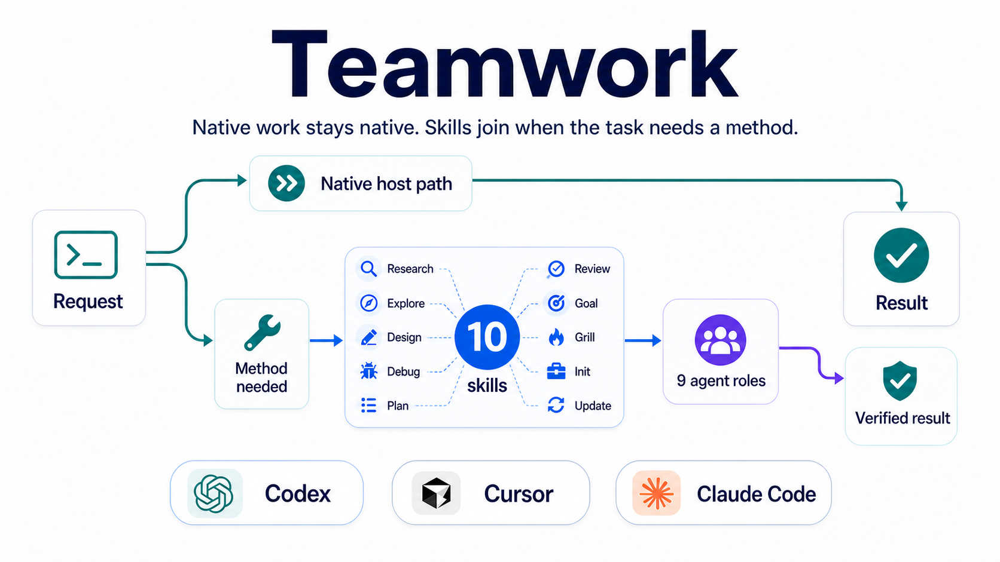

<p align="center">
  
</p>

<h1 align="center">Teamwork</h1>

<p align="center">
  <strong>A focused collaboration skill package for Codex, Cursor, and Claude Code.</strong><br>
  Teamwork does not take over ordinary local work: clear code inspection, file edits, and verification stay on the host's native path. It adds nine named methods when the task needs stronger constraints: collaborative convergence, external research, local evidence, unknown-cause debugging, planning, read-only review, long-running goals, project initialization, and global updates.
</p>

<p align="center">
  <a href="https://github.com/JinPLu/Teamwork/releases"></a>
  <a href="LICENSE"></a>
  
</p>

<p align="center">
  <a href="README.md">中文</a> ·
  <a href="CHANGELOG.en.md">Changelog</a> ·
  <a href="CODEX.md">Codex guide</a> ·
  <a href="CURSOR.md">Cursor guide</a> ·
  <a href="CLAUDE.md">Claude Code guide</a>
</p>

---

## ✨ What It Is

Teamwork is a set of on-demand collaboration methods, not a control layer that takes over the host. v5 recognizes discussion, direction convergence, and reusable intermediate results more aggressively: natural discussion, thinking together, brainstorming, grill, stress-testing, question-before-action intent, or an unsettled product/architecture/API direction activates Collaborate, which selects `dialogue`, `brainstorm`, or `grill` from the goal and evidence. Clear authorized local implementation still stays with Codex, Cursor, or Claude Code.

| Layer | Responsibility |
| --- | --- |
| Native host path | Read local code, config, tests, logs, and artifacts; make clear authorized edits; run real verification. |
| Nine public skills | Provide bounded methods for collaborative convergence, research, evidence, debugging, planning, review, long-running goals, project initialization, and global updates. |
| Nine optional agent roles | Researcher, Explorer, Debugger, Designer, Planner, Worker, Writer, Plan Reviewer, and Reviewer for Codex, Cursor, and Claude Code setups; the main task still owns scope, integration, and the final answer. |

## 🗃️ Documents and Persistence

In an initialized writable project, named Teamwork workflows persist reusable intermediate checkpoints and completion results by default as the matching artifact and register them in `docs/teamwork/index.json`; explicit `no files`, off-record, read-only, or no-write instructions override that default. One-shot explanations, casual fact questions, and tiny native work do not force a document. A sustained discussion with substantive synthesis and an unresolved question does default to one semantic checkpoint.

Teamwork 5.1 introduces v2 case bundles for newly initialized project memory. A case becomes the durable unit that holds live collaboration, accepted decisions, plans, evidence, reviews, goal state, and results under `docs/teamwork/cases/c-<64hex>/`. Existing projects remain on legacy-v1 routes until an explicit one-way cutover is authorized; installing or updating Teamwork never migrates or deletes project documents by itself.

Writer works only from a frozen bounded packet supplied by Root or a strong role. It may draft, organize, summarize, translate, and polish standalone documents or runtime artifacts, but must not research, invent, paraphrase, or change frozen facts, citations, decisions, authority, status, or acceptance conclusions, and must not self-accept. Content gaps fail closed and are reported unsaved. Code-coupled comments, docstrings, tests, schemas, manifests, machine config, and inline config text stay with the Worker or implementation owner.

Persistence first reads `docs/teamwork/index.json` to select the schema: in v2 projects, Collaborate, Research, Debug, Plan, Plan Review, Review, Goal, mutating Init/Update, and qualifying terminal execution handoffs write case transactions / case artifacts; in legacy-v1 projects, Collaborate and Goal keep their specialized routes, while Research, Debug, Plan, Plan Review, Review, mutating Init/Update, and terminal execution handoffs keep the existing generic artifact transaction. Writer calls a transaction from frozen content; the transaction is the actual filesystem writer. Explore creates no standalone report; its evidence is folded into the artifact or answer that consumes it.

| Workflow | Persisted by default? | Main artifact | Later consumption |
| --- | --- | --- | --- |
| One-shot explanation, casual fact question, or tiny native work | No | No forced artifact | Continue from the conversation and native host context. |
| Collaborate | Yes after sustained collaboration + substantive synthesis/candidate space/decision map + an unresolved question or unaccepted direction | v2 case live collaborate/decision; legacy-v1 controlled Collaborate | Resume the same collaboration from the case manifest in v2 or the current record in legacy-v1; once accepted, it is the only public Plan entry. Legacy Discussion/Design artifacts are read-only migration inputs. |
| Research | Yes | v2 case evidence; legacy-v1 research artifact | Supplies cited evidence for Collaborate, Plan, Review, docs, or final answers. |
| Direction convergence | Handled by Collaborate | Collaborate with `pending`, `accepted`, or `blocked` acceptance | Only accepted Collaborate may enter Plan; the internal Designer remains a read-only participant for direction selection, challenge, or convergence audit. |
| Plan | Yes | v2 case plan; legacy-v1 canonical plan | Root/Worker execute by owner, path, verification, and stop rules. |
| Debug | Yes | v2 case evidence/result; legacy-v1 diagnosis/report | Root/Worker continue from the cause, fix boundary, and same-path proof. |
| Plan Review / Review | Yes; persistence is not acceptance | v2 case review/delta; legacy-v1 review | Root uses the evidence verdict to repair, replan, or close. |
| Goal | Yes | Existing entry/attempt/status | Later turns resume from objective, budget, success signal, and blocker state; an active Goal suppresses duplicate execution artifacts. |
| Native / Worker execution | Only for a terminal handoff with an explicit downstream consumer and no active Goal | Execution | Hands the completed result to the named Plan, Review, release, or other real consumer. |
| Mutating Init / Update | Yes | Receipt | Supports readiness checks, troubleshooting, and user review. |
| Explore | No | No standalone report | Local evidence is folded into the consuming Collaborate, Plan, Debug, Review, Goal, or answer. |

Collaborate uses only its specialized route and cannot be replaced by a generic report, conclusion, legacy Discussion, or legacy Design; execution cannot be replaced by conclusion either. Conclusion is reserved for a genuinely distinct requested synthesis document.

During cutover, legacy documents are treated as migration inputs and then cold-archive sources. The cold archive preserves bytes and POSIX mode only and is not a physical backup; Teamwork does not delete cold archive objects automatically.

| Situation | Recommended use |
| --- | --- |
| The local change is already clear | Describe the outcome directly; no Teamwork skill is needed. |
| You need current external facts, official docs, papers, or citations | Use `$teamwork-research`. |
| You need read-only local evidence from code, config, logs, tests, history, or artifacts | Use `$teamwork-explore`. |
| You want to think together, brainstorm, converge iteratively, or be questioned or stress-tested before action | Describe that intent directly or use `$teamwork-collaborate`; it selects dialogue, brainstorm, or grill. |
| A product, architecture, workflow, or API direction is unsettled and must become an accepted direction | Describe the choice directly or use `$teamwork-collaborate`; it may call the internal read-only Designer for ordinary challenge or adversarial search. |
| A failure has an unknown cause and cannot be fixed safely yet | Use `$teamwork-debug`. |
| The controlled Collaborate state is `accepted` and needs executable steps | Use `$teamwork-plan`. |
| A plan, diff, artifact, or completion claim needs independent acceptance | Use `$teamwork-review`. |
| You explicitly want work to continue until green, passing, or a budgeted target | Use `$teamwork-goal`. |
| You need to initialize one project or refresh global installation | Use `$teamwork-init` and `$teamwork-update`, respectively. |

## 🛡️ What It Keeps Out

| What you do not want | What Teamwork does |
| --- | --- |
| 🔁 Endless testing and review without delivery | Get the real result first; tests and review serve the changed path or a named risk gate. |
| 🧱 Workflow overhead for small work | Simple answers, small edits, and clear implementation requests stay on the fast host path. |
| 🕳️ Invented paths, ports, models, or state | Check project files, logs, config, official sources, and actual output. |
| ❓ Broad questions before inspection | Contribute synthesis, candidate space, or a recommendation first. Ask open questions in prose; use the native choice surface only for genuine 2–3-option bounded decisions, and serialize dependent questions. |
| 🧑‍⚖️ Review replacing execution | Review is read-only by default and returns evidence-backed `ACCEPT`, `REVISE`, or `BLOCKED`. |

---

## 🧩 Nine skills, named when useful

Most of the time, describe the outcome directly. Name a skill when you want exact behavior.

| Skill | Use it when |
| --- | --- |
| 🔎 `$teamwork-research` | You need external facts, official docs, papers, market information, or cited sources. |
| 🗂️ `$teamwork-explore` | You need read-only local evidence from code, config, logs, tests, history, or artifacts. |
| 💬 `$teamwork-collaborate` | You want dialogue, brainstorming, grill/stress-testing, question-before-action, or an unsettled direction converged into an accepted handoff; it selects dialogue, brainstorm, or grill and saves a checkpoint at the semantic threshold. |
| 🐞 `$teamwork-debug` | A failure has an unknown cause and needs reproduction before a safe fix. |
| 📝 `$teamwork-plan` | The direction is selected and needs owned steps, dependencies, acceptance, and stop conditions. |
| ✅ `$teamwork-review` | A plan, diff, artifact, or completion claim needs an independent check. |
| 🎯 `$teamwork-goal` | You explicitly want Codex to keep going until green, passing, or a budgeted target. |
| 🧰 `$teamwork-init` | One repository needs project instructions, Teamwork memory entry points, or CodeGraph context. |
| 🔄 `$teamwork-update` | Global Teamwork skills, agents, policy, routing, or notifications need a refresh. |

Examples:

```text
Use $teamwork-research to read official docs and key papers, then give a cited recommendation.
Use $teamwork-collaborate to brainstorm a lower-maintenance onboarding flow with me.
This public API could be synchronous, queued, or hybrid. A wrong choice forces an expensive migration on every client, and the latency and reliability evidence conflicts. Help me decide.
Use $teamwork-debug to reproduce this CI failure, confirm the cause, and fix the same path.
Implement this change directly; verify only the affected path and stop when it works.
Use $teamwork-review to check this release for false success or stale wording.
Use $teamwork-goal to keep fixing until the named check passes, stopping only on a real blocker.
```

---

## 🚀 Quick start

### 🤖 Codex default: Marketplace plugin

```bash
codex plugin marketplace add JinPLu/Teamwork
codex plugin add teamwork-skill@teamwork
```

Start a new Codex task, then run:

```text
$teamwork-update
```

`$teamwork-update` explains the Codex agents, routing, managed global policy, notifications, and verified legacy cleanup it proposes, then waits for approval. Skills load directly from the plugin cache; they are not copied to `~/.agents/skills`, and Teamwork does not overwrite content whose ownership is uncertain.

### 🖥️ Cursor, Claude Code, or development checkout

```bash
git clone https://github.com/JinPLu/Teamwork.git
cd Teamwork
./install.sh all
./scripts/check-update.sh --readiness
```

Install only one host when preferred:

```bash
./install.sh cursor
./install.sh claude
./install.sh codex   # for development or manual Codex setup; normal Codex users use the plugin
```

Cursor also needs `./install.sh cursor-policy-copy`, followed by a manual paste into **Cursor Settings → Rules → User Rules**.

---

## 🧠 Codex agents and profiles

Full Codex setup installs nine custom agents: Researcher, Explorer, Debugger, Designer, Planner, Worker, Writer, Plan Reviewer, and Reviewer. They are used only when separate context, standalone document writing, or independent acceptance is worth it; the main task still owns scope, integration, and the final response. Writer uses a simple model for standalone project/product docs, README/guide/architecture/change/release notes, and Teamwork runtime artifacts; code, code comments, docstrings, tests, schemas, manifests, machine config, and inline config text remain with implementation owners.

| Profile | High-frequency execution roles | Document Writer | Collaborate / plan review | Final review |
| --- | --- | --- | --- | --- |
| `performance-first` | `gpt-5.5` / `high` | `gpt-5.5` / `low` | `gpt-5.6-sol` / `high` | `gpt-5.6-sol` / `max` |
| `cost-first` | `gpt-5.5` / `medium` | `gpt-5.5` / `low` | Designer uses `gpt-5.6-sol` / `medium`; Plan Reviewer uses `gpt-5.6-sol` / `high` | `gpt-5.6-sol` / `high` |

This split keeps frequent evidence, diagnosis, planning, and implementation loops fast, moves standalone prose to the simple Writer, and leaves consequential choices and independent acceptance to the more conservative reviewer path. Writer may organize, summarize, translate, and polish expression, but must not research, invent facts, paraphrase or change frozen citations, decisions, permissions, status, acceptance, or self-accept.

---

## 🔄 Updates

Codex plugin update:

```bash
codex plugin marketplace remove teamwork
codex plugin marketplace add JinPLu/Teamwork
codex plugin add teamwork-skill@teamwork
```

Then start a new task and run `$teamwork-update`.

Checkout update:

```bash
git pull --ff-only
./install.sh all
./scripts/check-update.sh --readiness
```

For release reminders, open [JinPLu/Teamwork](https://github.com/JinPLu/Teamwork) and choose **Watch → Custom → Releases**. Notifications do not automatically update a local plugin or configuration.

---

## 🛡️ Safety boundaries

- Research, Collaborate, Plan, diagnostic Debug, and Review do not authorize candidate edits or external effects; reusable results from named workflows still persist by default under the matrix above, and accepting a Plan does not authorize implementation.
- Collaborate auto-selects adversarial only when at least two viable directions remain and costly or irreversible error or conflicting evidence makes one ordinary challenge inadequate, using the internal read-only Designer; merely saying “high-risk” or “complex” does not trigger it. The model states why and uses default `B=3` without another confirmation; `adversarial` / `standard` remain force and disable overrides. Every actual hypothesis receives two fresh critics and two new final auditors must both pass. Collaborate v1 always records `acceptance: pending`, `accepted`, or `blocked`; unproven isolation or closure can remain `pending` or become `blocked`, never Plan-ready. Persistence is not acceptance, and only `accepted` may enter Plan.
- Natural discussion, thinking together, brainstorming, grilling, stress-testing, or “ask me before action” intent activates Collaborate more aggressively. It contributes useful synthesis, candidate space, a decision map, or provisional recommendation first. Grill strictly follows global → boundary → detail, asks at most three independent decisions per batch, serializes dependent decisions, and applies one complete semantic update per answered batch. Open questions stay in prose, while only genuine 2–3-option bounded choices use the Codex-native question surface; the host must actually expose `request_user_input`. Once the sustained-collaboration semantic threshold is met, first read `docs/teamwork/index.json` to select the schema: v2 updates the selected case `live/collaborate.md` through Writer and case transactions, while only legacy-v1 maintains `docs/teamwork/collaborate/current.md` through Collaborate transactions. If the host does not provide Writer, route, or readback, the result must be reported unsaved rather than simulated by Root. Collaborate never saves a transcript or mirrors itself into a report/conclusion or legacy Discussion/Design; `no files`, off-record, read-only, or no-write always wins.
- The installer deletes only entries it can prove Teamwork generated. Never delete a whole `.agents`, `.codex`, `.cursor`, or `.claude` directory.
- After enabling Codex notifications, restart Codex and trust only Teamwork's `Stop` and `PermissionRequest` handlers in `/hooks`. Do not use trust-all.
- `./scripts/check-update.sh --readiness` checks Teamwork-managed files and configuration only; it cannot perform Cursor User Rules or hook-trust steps for the host.
- v5 removes the public `$grill-me`, `$teamwork-discuss`, and `$teamwork-design` names; `$teamwork-collaborate` now owns all three collaboration modes and accepted-direction convergence. Router, Execute, and legacy role aliases remain absent. Upgrade removes only old Grill/Discuss/Design/Router/Execute copies whose exact content proves Teamwork ownership; modified or unmarked copies are preserved and block automatic replacement, and no aliases are created.
- v5.1 keeps legacy-v1 project memory compatible while fresh projects use v2 case bundles. Cutover is separate, explicit, and one-way; update/install alone must not rewrite existing `docs/teamwork` documents.

---

## 📚 Learn more

- [Changelog](CHANGELOG.en.md): user-visible changes and upgrade notes.
- [Codex](CODEX.md), [Cursor](CURSOR.md), and [Claude Code](CLAUDE.md): full platform setup and troubleshooting.
- [Repository architecture](docs/architecture.md): source layout, generated directories, dependency boundaries, and stable commands.
- [Contributing](CONTRIBUTING.md): change scope and verification requirements.
- [GitHub Issues](https://github.com/JinPLu/Teamwork/issues): report a problem or suggest an improvement.
