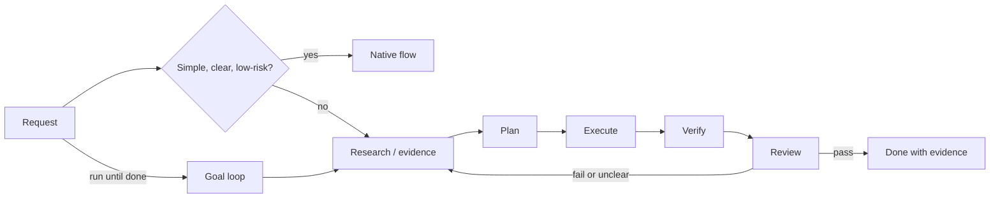

# Teamwork


Teamwork 是给 Claude Code、Codex 和 Cursor 使用的 workflow skill package。它的目标不是增加流程感，而是在复杂任务里让 agent **先拿证据、复用调研、维护可复查文件、正确使用 subagent，并在 goal 未达成时继续迭代而不是早停**。

简单任务继续 native flow；只有证据、计划、复查、并行或自主收敛能提高正确性时才进入 Teamwork。

## Core Advantages

| 核心优势 | 具体约束 |
|---|---|
| Evidence and research first | 重要判断必须来自代码、diff、日志、测试、artifact 或外部主源；不要只看文件名、README、注释、旧总结、`latest`/`v2` 这类过期叙述就下结论。Research calibration 先读本地真实主线，再用官方文档、论文、release notes、upstream issue 等校准。 |
| Goal should not stop early | `teamwork-goal` 未达成目标时不要轻易 block。失败、no-progress、review 不通过或验收不清楚时，先回到 research + plan adequacy：刷新证据、检查计划是否欠调研/过期/范围错/stop rule 过严，再重写计划继续迭代。 |
| Artifacts prevent repeated work | `docs/teamwork/research/`、`docs/teamwork/plans/`、`docs/teamwork/reports/` 是跨 turn、跨 agent 的事实锚点。它们减少重复 research 和上下文膨胀，也让人类能复查 evidence、attempt、verification、review 和 routing decision。 |
| Better subagent use | 非轻量任务先拆独立轨道，再给 Explorer、Worker、Reviewer 明确范围、所有权、模型 tier、context strategy 和交付格式。并行是为了节省关键路径和获得 fresh context，不是为了仪式感。 |

## Skill Map

`using-teamwork` 是入口，`teamwork` 是 router。你不用记 skill 名，按自然语言说即可。

| 你说 | 触发 | 结果 |
|---|---|---|
| “查原因 / 比较方案 / 研究失败” | `teamwork-research` | 直接证据、外部校准、可复用 research artifact |
| “先给计划 / 这个改动怎么做” | `teamwork-plan` | 轻量计划或 durable execution memo |
| “执行这个计划” | `teamwork-execute` | 计划内最小改动和 focused verification |
| “review 计划 / diff / 结果” | `teamwork-review` | 独立 verdict、dissent、回归风险 |
| “跑到通过为止 / 继续迭代直到收敛” | `teamwork-goal` | 预算内自主循环、rolling report、completion audit |

Skill entrypoints: `using-teamwork`, `teamwork`, `teamwork-research`, `teamwork-plan`, `teamwork-execute`, `teamwork-review`, `teamwork-goal`.

## Workflow



## Artifacts

只在需要跨 turn、跨 agent、goal-mode 或人工复查时落盘；简单任务不要写 artifact。

```text
docs/teamwork/research/YYYY-MM-DD-<slug>.md
docs/teamwork/plans/YYYY-MM-DD-<slug>.md
docs/teamwork/reports/YYYY-MM-DD-<slug>.md
```

| 目录 | 用途 | 必须方便复查的问题 |
|---|---|---|
| `research/` | 可复用调研、失败分析、外部校准 | 读了什么证据？哪些结论是 observed/inferred/claimed？什么时候需要 refresh？ |
| `plans/` | 执行备忘录和 review source of truth | 目标、范围、步骤、验证、风险、Worker/Review handoff、Subagent Routing 是否清楚？ |
| `reports/` | goal rolling memory 和非轻量结论 | 尝试了什么？验证结果如何？是否复用 research？读了哪些 artifact？为什么使用或跳过 subagent？ |

这些目录默认 gitignored。只有当某个 artifact 本身是 PR 内容时才 force-add。

## Runtime Notes

### Codex runtime

Codex 使用原生能力，不模拟 Claude hook：

- `update_plan` 是临时 UI 进度，不是 durable plan。
- Codex native goals 只用于显式自主收敛或已有 active goal。
- Codex subagents 用于独立 Explorer、scoped Worker、fresh-context Reviewer。
- Teamwork 激活后，视为用户已授权对独立的非轻量轨道自动分配 subagent；不需要额外 “fan out” 确认。
- Ordinary plans should record conceptual role, scope, tier, context strategy, order, and why; native Codex fields are derived from `skills/teamwork/SKILL.md` only when dispatching.

### Claude commands

Claude Code 使用 `/teamwork:*`；`/rao:*` 是兼容别名，所以 `/rao:goal` 仍可用。状态文件在：

```text
.claude/teamwork-goals/
```

常用命令：

```text
/teamwork:goal 修复 pytest X，最多 3 轮，无进展就停 --max-iterations 3
/teamwork:plan docs/teamwork/plans/2026-05-14-fix-pytest-x.md
/teamwork:checkpoint --plan-review-verdict pass --execution-review-verdict pass --verification-command "pytest X" --verification-result pass --evidence-delta progress --research-disposition reuse --research-artifacts-read "docs/teamwork/research/2026-05-14-fix-pytest-x.md" --agent-routing-decision "main-agent continuity; no useful parallel Worker track"
```

Stop hook 会继续未完成 goal，直到完成、达到 max iterations、pause/stop、真 blocker 或连续 no-progress。默认 completion promise 是 `RAO_GOAL_COMPLETE`。

自动完成需要 promise 和结构化 audit；`requirements_mapping` 与 `verification_evidence` 必须写具体命令、路径、artifact 或 requirement-to-evidence 映射：

```text
<completion_audit>
<plan_artifact>docs/teamwork/plans/YYYY-MM-DD-slug.md</plan_artifact>
<plan_artifact_sha256>recorded sha256</plan_artifact_sha256>
<plan_review_verdict>pass</plan_review_verdict>
<execution_review_verdict>pass</execution_review_verdict>
<requirements_mapping>requirement -> command/path/artifact evidence</requirements_mapping>
<verification_evidence>commands, artifacts, or inspected evidence</verification_evidence>
<dissent>none or preserved dissent/residual risk</dissent>
</completion_audit>
```

`/teamwork:complete` 和 `/rao:complete` 是手动 override，不代表自动验证通过。

## Install

```bash
./install.sh codex
./install.sh claude
./install.sh cursor /path/to/project
./install.sh all /path/to/project
```

Validate this repo:

```bash
./scripts/validate.sh
```

Behavior lives in `skills/*/SKILL.md`; platform docs summarize instead of duplicating the full skill bodies.
