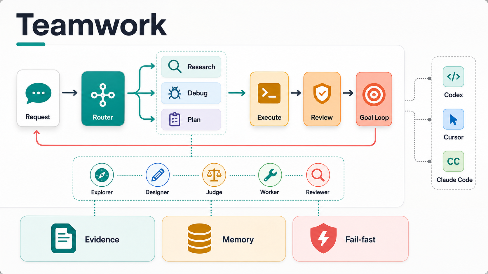

# Teamwork

[English](README.en.md) · [更新日志](CHANGELOG.md) · [参与贡献](CONTRIBUTING.md) · [MIT License](LICENSE)

**让 Codex、Cursor 和 Claude Code 在复杂科研与工程任务中先找证据、再行动，并用可检查的结果收尾。**

Teamwork 是一个 Codex-first 的 skill package。安装后，照常用自然语言描述目标即可；它会在任务需要时组织调研、排错、计划、执行和验收，简单任务仍直接完成。



## 你会得到什么

- **更可靠的调研：** 从原始来源、项目文件和实际配置中找证据，不凭空补路径、端口、模型或参数。
- **更聚焦的提问：** 先自行检查可发现的事实，只把会改变结果、范围、验收或权限的决定交给你。
- **更可控的协作：** 只在任务适合拆分时使用 subagent，主 agent 负责范围、集成和最终验证。
- **更明确的完成标准：** 用来源、日志、测试、diff 或复查结果说明任务是否真的完成。
- **更好的长任务连续性：** 对需要多轮推进的目标保留必要证据，失败后从受影响的工作继续。

适合文献与领域调研、技术选型、复杂方案、可复现故障、CI、跨文件实现、严格 review，以及“持续推进直到通过”的任务。一句话事实和明显的小编辑不会被强行套流程。

## 快速开始

需要先安装并能正常使用 Codex、Cursor 或 Claude Code 中的至少一个。本仓库的安装入口使用 Bash。

以 Codex 为例：

```bash
git clone https://github.com/JinPLu/Teamwork.git
cd Teamwork
./install.sh codex
./scripts/check-update.sh --no-fetch
```

安装后直接描述你想要的结果，不需要记 skill 名称：

```text
调研这个领域、关键论文和现有代码，再给我一个可执行方案。
定位这个 CI 失败的根因，用日志和复现证据确认后修复。
按已接受的计划执行并验证，失败时继续迭代，直到通过或遇到真实 blocker。
严格 review 这次产出，重点检查假成功、防御性 fallback 和 AI 冗余。
grill me：只挑战会改变结果的关键决定，没有实质问题就停止。
```

## 安装

| 目标 | 命令 |
|---|---|
| Codex | `./install.sh codex` |
| Cursor | `./install.sh cursor` |
| Claude Code | `./install.sh claude` |
| 全部平台 | `./install.sh all` |

这些用户级命令让 Teamwork skills 和 agents 对当前用户可用，不会自动修改每个项目。若只想配置某个仓库，请使用下面的 `project` 或 `init-project` 目标并明确项目路径。

默认安装使用 `performance-first` profile。查看所有目标和选项：

```bash
./install.sh --help
```

常用选项：

```bash
./install.sh --profile cost-first codex
./install.sh --notifications codex
./install.sh --project-root /path/to/project project
./install.sh --project-root /path/to/project init-project
```

- `--profile cost-first`：优先使用当前低成本模型。
- `--notifications`：为直接平台安装添加主任务完成音和权限请求音；subagent 保持静音。完整的 `all`/`init-project` 安装默认启用，可用 `--no-notifications` 退出。Codex 安装后需在 CLI 运行 `/hooks`，逐项审核并信任两项 Teamwork hook。
- `project`：只把 Teamwork 的项目级 skills 和 agents 安装到指定仓库。
- `init-project`：为一个指定仓库执行完整初始化，包括项目级 skills、agents、项目规则、Teamwork 工作记录入口和可用的 CodeGraph；它也会安装当前用户的全局 skills、agents 和默认规则。

Codex 用户级安装更新角色路由后需要重启 Codex。Cursor User Rules 仍需手动复制粘贴，安装器无法验证是否已完成。安装器只管理 Teamwork 自己的目录、规则块和有限配置；不会接管平台权限、MCP、浏览器或测试设置。平台细节见 [Codex](CODEX.md)、[Cursor](CURSOR.md) 和 [Claude Code](CLAUDE.md)。

## 更新

更新仓库后，重新执行原安装命令并检查安装状态：

```bash
git pull --ff-only
./install.sh codex
./scripts/check-update.sh --no-fetch
```

如需同时检查某个项目的本地安装：

```bash
./scripts/check-update.sh --project /path/to/project
```

## 更多信息

- [更新日志](CHANGELOG.md)：每个版本中用户能感受到的变化。
- [Codex 指南](CODEX.md)、[Cursor 指南](CURSOR.md)、[Claude Code 指南](CLAUDE.md)：平台安装与高级用法。
- [项目结构](docs/architecture.md)：canonical source、生成目录、稳定命令和变更 owner。
- [参与贡献](CONTRIBUTING.md)：修改范围和验证要求。
- [GitHub Issues](https://github.com/JinPLu/Teamwork/issues)：问题反馈与建议。
