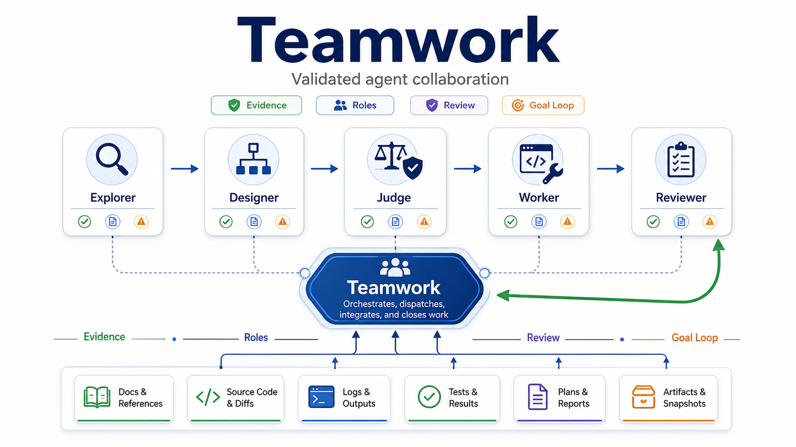

# Teamwork

[English](README.en.md)



Teamwork 是一个 **Codex-first 的 Codex + Cursor + Claude Code skill package**。
各平台 native capabilities 是 execution substrate；Teamwork 只补一层协作协议：
证据优先、主动分工、可复用记忆、fresh review，以及能持续推进的 goal loop。

Codex 是 1.0 的 reference runtime。Codex 原生 goal 是自治控制面；
`teamwork_*` custom agents 是非轻量工作的默认协作网络。Cursor 和 Claude
Code 作为 adapter 使用同一套 Teamwork 协议。

## 适合什么

- 需要调查、规划、执行、验证、review 串起来的 coding-agent 工作。
- 需要 Codex subagents 主动分担探索、实现、复查、调研，而不是用户每步手推。
- 需要跨回合保存证据、计划、结果或失败尝试的任务。
- 需要“持续迭代直到可验证目标达成”的目标型工作。

不适合：一句话事实、很小的明显编辑、敏感/破坏性操作、强耦合临界路径，或 subagent 上下文成本高于收益的任务。

## Teamwork 增加什么

| 能力 | 作用 |
|---|---|
| Evidence first | 重要结论必须映射到源码、diff、日志、测试、artifacts 或 primary sources。 |
| Proactive dispatch | 非轻量 research / plan / execute / review / goal 阶段默认分发 Explorer、Designer、Judge、Worker、Reviewer。跳过需写 `Dispatch Exception`。 |
| Goal control | 不清晰目标先出 `Goal Proposal`；Codex 用 Goal Text 调 `create_goal`，Cursor/Claude Code 用 rolling report。 |
| Artifact memory | `docs/teamwork/research/YYYY-MM-DD-<slug>.md`、`docs/teamwork/plans/YYYY-MM-DD-<slug>.md`、`docs/teamwork/reports/YYYY-MM-DD-<slug>.md` 保存可复用证据和结论。 |
| Native index | 可选 `docs/teamwork/index.json` / `current.md` 锁定当前设计、结果、进度，避免反复读历史。 |
| Memory Delta | 只有 durable project memory 被检查或改变时报告，避免文档膨胀。 |

## Skill Map

`using-teamwork` 是自动入口和 lean router；具体阶段由它分流：

| 意图 | Skill |
|---|---|
| 初始化/瘦身项目规则 | `teamwork-init` |
| 调查、比较、刷新假设 | `teamwork-research` |
| 规划非平凡改动 | `teamwork-plan` |
| 执行已接受计划 | `teamwork-execute` |
| 审查计划、diff、结果 | `teamwork-review` |
| 版本、manifest、发布面更新 | `teamwork-update` |
| 持续迭代直到目标达成 | `teamwork-goal` |

`VERSION` 是包版本 source of truth，必须和 `.codex-plugin/plugin.json`、
`.claude-plugin/plugin.json` 保持一致；版本和 skill surface 更新走
`teamwork-update`。

## 安装

推荐一次装好三端：

```bash
./install.sh all
```

按平台安装：

```bash
./install.sh codex          # Codex skills + custom agents + 全局规则
./install.sh cursor
./install.sh claude
./install.sh codex-agents   # 仅刷新 ~/.codex/agents/
./install.sh claude-agents  # 仅刷新 ~/.claude/agents/
```

项目级安装写入已 gitignore 的 `.cursor/skills/`、`.codex/agents/`、
`.claude/agents/`：

```bash
./install.sh project
```

本地开发使用 symlink：

```bash
./install.sh --link codex
./install.sh --link all
./install.sh --link project
```

## Codex 授权模型

Codex 需要用户 prompt 或已加载项目/全局 instructions 明确授权 `spawn_agent`。
`./install.sh codex` 会维护 `~/.codex/AGENTS.md` 中的 Teamwork 全局规则块；
授权存在后，Teamwork 会主动派发非轻量阶段的独立工作。主 agent 仍负责
scope、ownership、integration、verification、关闭 dispatch track 和最终交付。

## 进一步阅读

- [CODEX.md](CODEX.md)：Codex runtime profile 和 custom-agent 映射。
- [CURSOR.md](CURSOR.md)：Cursor adapter。
- [CLAUDE.md](CLAUDE.md)：Claude Code adapter。
- `skills/*/SKILL.md`：实际行为定义。
- `skills/using-teamwork/references/`：dispatch、artifact、review、goal 等细节。

验证仓库：

```bash
./scripts/validate.sh
```
