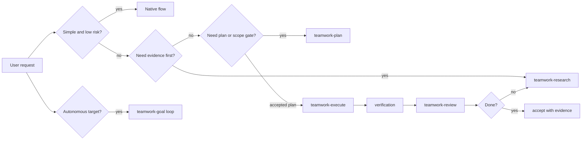

# Teamwork


Teamwork 是给 Claude Code、Codex 和 Cursor 使用的一组 workflow skills。它不替代 coding agent，而是在任务容易跑偏时加入证据、计划、执行边界、复查和收敛机制。

一句话：**先弄清楚，再动手；执行有边界，完成有证据。**

## Why

Teamwork 最新的动机不是“给 agent 加流程”，而是把复杂任务里的协作成本降下来：入口要短，规则要集中，关键判断要有证据，跨 turn 或跨 agent 的状态要能被人复查。

| Need | Why it matters | Teamwork answer |
|---|---|---|
| Keep simple work fast | 大多数小任务不需要 ceremony | native flow 仍是默认；只有证据、计划、复查、并行或收敛有价值时才激活 |
| Avoid context bloat | 长 skill、长日志、重复规则会吞掉模型上下文 | stage skill 保持短，共享规则放进 references，按需读取 |
| Reuse hard-won research | 重复调研会浪费时间，也容易忘记旧证据和失败尝试 | `research/` 和 `reports/` 记录可复查证据、刷新点、attempt 和 no-progress |
| Use subagents deliberately | 并行只有在问题可拆、所有权清楚时才有收益 | 非轻量任务先拆独立轨道，再给 Explorer、Worker、Reviewer 明确范围和交付 |
| Make completion auditable | “看起来完成了”不等于验收通过 | plan、verification、review、checkpoint、completion audit 都指向具体命令、路径或 artifact |

结果是：简单任务不被打扰；复杂任务有短入口、强引用、硬约束和可评测结果。

## Skill Map

你不需要记 skill 名，按自然语言说即可。`using-teamwork` 是入口，`teamwork` 是 router，其他 stage 只在对应任务需要时启用。

| 你想做什么 | Teamwork 用什么 | 产出 |
|---|---|---|
| “查一下原因 / 比较方案 / 研究这个失败” | `teamwork-research` | 直接证据、外部校准、可复用 research artifact |
| “先给计划 / 这个改动怎么做” | `teamwork-plan` | 轻量计划或 durable execution memo |
| “执行这个计划” | `teamwork-execute` | 计划内最小改动和 focused verification |
| “review 计划 / diff / 结果” | `teamwork-review` | 独立 verdict、dissent、回归风险 |
| “跑到通过为止 / 继续迭代直到收敛” | `teamwork-goal` | 有预算的自主循环、rolling report、completion audit |

Skill entrypoints: `using-teamwork`, `teamwork`, `teamwork-research`, `teamwork-plan`, `teamwork-execute`, `teamwork-review`, `teamwork-goal`.

## How It Decides



普通、明确、低风险的一步任务继续走 native flow。Teamwork 只在证据、计划、复查、并行或自主收敛能提高正确性时介入。

## Core Advantages

| Advantage | What changes in practice |
|---|---|
| Evidence first | 重要判断区分 `observed`、`inferred`、`claimed`；文件名、README、总结和版本号不直接当事实。 |
| Research calibration | 先读本地真实主线，再用官方文档、论文、release notes、upstream issue 等外部主源校准。 |
| Short entry, strong references | stage skill 保持短；共享规则集中在 `skills/teamwork/references/workflow-contract.md`。 |
| Durable anchors only when useful | 简单任务不写 artifact；跨 turn、跨 agent、高风险、goal-mode 才写 durable memo。 |
| Bounded execution | Worker 只做计划内改动；发现需求、架构或外部证据缺口就回 research/plan。 |
| Review before done | 完成前看 diff、测试、artifact 和验收映射；工具输出只是证据，不是最终 verdict。 |
| Subagent where it helps | 非轻量任务优先拆独立轨道，避免重复 research，并用所有权限制并行 Worker。 |

## Typical Flows

| 场景 | 推荐流程 |
|---|---|
| 小而明确的改动 | native/brief plan -> edit -> focused check -> self-review |
| 非轻量 bug | research local mainline -> external calibration -> plan -> execute -> review |
| 高风险或跨 agent | research artifact -> durable plan -> plan review -> scoped Worker -> verification -> execution review |
| 自主收敛 | retrieve memory -> research/plan -> review -> execute -> verify -> review -> report row -> accept/revise/block |

Research calibration 的目标是避免“本地猜两轮再说”。如果一次 focused fix 没有 evidence delta，就应该刷新 research 或检查 plan adequacy。

## Artifacts

Teamwork 的文件只在需要跨 turn、跨 agent 或人工复查时落盘：

```text
docs/teamwork/research/YYYY-MM-DD-<slug>.md
docs/teamwork/plans/YYYY-MM-DD-<slug>.md
docs/teamwork/reports/YYYY-MM-DD-<slug>.md
```

| Artifact | 什么时候写 | 应包含 |
|---|---|---|
| `research/` | 结论会复用、喂给计划、goal 失败分析、外部校准 | local evidence、external sources、recommendation、dissent、refresh triggers |
| `plans/` | goal-mode、跨 agent、跨 turn、高风险、含糊、显式要求仓库计划 | scope、requirements mapping、steps、verification、risks、handoff、Subagent Routing |
| `reports/` | goal rolling memory 或非轻量结论 | attempts、verification、review verdict、research reuse、artifacts read、agent routing |

这些目录默认 gitignored，避免把本地过程产物误提交。Force-add only when a specific artifact is intentionally part of a PR.

## Codex Runtime

Codex runtime 是 **native, not hook-emulated**：

- `update_plan` 是临时 UI 进度，不是 durable plan。
- Codex native goals 只用于显式自主收敛或已有 active goal。
- Codex subagents 用于独立 Explorer、scoped Worker、fresh-context Reviewer。
- Teamwork 激活后，视为用户已授权对独立的非轻量轨道自动分配 subagent；不需要额外 “fan out” 确认。
- Ordinary plans should record conceptual role, scope, tier, context strategy, order, and why; native Codex fields are derived from `skills/teamwork/SKILL.md` only when dispatching.
- Sandbox、网络和权限按 Codex approval model 走，不绕过。

## Claude Commands

Claude Code 使用 `/teamwork:*`；`/rao:*` 保留为兼容别名，所以 `/rao:goal` 仍可用。状态文件在：

```text
.claude/teamwork-goals/
```

常用命令：

```text
/teamwork:goal 修复 pytest X，最多 3 轮，无进展就停 --max-iterations 3
/teamwork:plan docs/teamwork/plans/2026-05-14-fix-pytest-x.md
/teamwork:checkpoint --plan-review-verdict pass --execution-review-verdict pass --verification-command "pytest X" --verification-result pass --evidence-delta progress --research-disposition reuse --research-artifacts-read "docs/teamwork/research/2026-05-14-fix-pytest-x.md" --agent-routing-decision "main-agent continuity; no useful parallel Worker track"
```

Stop hook 会继续未完成 goal，直到完成、达到 max iterations、pause/stop、blocker 或连续 no-progress。默认 completion promise 是 `RAO_GOAL_COMPLETE`。

自动完成需要 promise 和结构化 audit；`requirements_mapping` 与 `verification_evidence` 必须写具体命令、路径、artifact 或 requirement-to-evidence 映射：

```text
<completion_audit>
<plan_artifact>docs/teamwork/plans/YYYY-MM-DD-slug.md</plan_artifact>
<plan_artifact_sha256>recorded sha256</plan_artifact_sha256>
<plan_review_verdict>pass</plan_review_verdict>
<execution_review_verdict>pass</execution_review_verdict>
<requirements_mapping>requirement -> command/path/artifact evidence</requirements_mapping>
<verification_evidence>commands, artifacts, or inspected evidence</verification_evidence>
<dissent>none or preserved dissent/residual risk</dissent>
</completion_audit>
```

`/teamwork:complete` 和 `/rao:complete` 是手动 override，不代表自动验证通过。

## Install

```bash
./install.sh codex
./install.sh claude
./install.sh cursor /path/to/project
./install.sh all /path/to/project
```

Validate this repo:

```bash
./scripts/validate.sh
```

Behavior lives in `skills/*/SKILL.md`; platform docs summarize instead of duplicating the full skill bodies.
