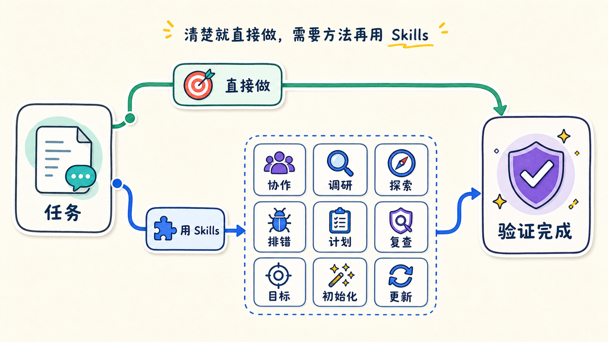

<p align="center">
  
</p>

<h1 align="center">Teamwork</h1>

<p align="center">
  <strong>让 Codex、Cursor 和 Claude Code 在该直接做时直接做，在需要方法时调用方法。</strong><br>
  Teamwork 提供 9 个按需使用的 skills，覆盖讨论收敛、外部调研、本地证据、未知失败排查、计划、复查、持续目标、项目初始化和全局更新。
</p>

<p align="center">
  <a href="https://github.com/JinPLu/Teamwork/releases"></a>
  <a href="LICENSE"></a>
  
</p>

<p align="center">
  <a href="README.en.md">English</a> ·
  <a href="CHANGELOG.md">更新日志</a> ·
  <a href="CODEX.md">Codex</a> ·
  <a href="CURSOR.md">Cursor</a> ·
  <a href="CLAUDE.md">Claude Code</a>
</p>

---

> [!TIP]
> **不需要先背会 9 个 skills。** 大多数时候直接描述结果；只有想精确控制工作方式时，才显式写出 `$teamwork-*` 名称。

## 🚀 一分钟开始

### Codex：推荐使用 Marketplace plugin

```bash
codex plugin marketplace add JinPLu/Teamwork
codex plugin add teamwork-skill@teamwork
```

开启一个新的 Codex 任务，运行：

```text
$teamwork-update
```

它会先解释准备配置的 agents、路由、全局策略和通知，再等待确认。配置完成后重启 Codex；如果启用了通知，请在 `/hooks` 中分别信任 Teamwork 的 `Stop` 和 `PermissionRequest`，不要使用 trust-all。

如果希望某个仓库拥有项目说明、Teamwork memory 和 CodeGraph 上下文，请在该仓库中运行：

```text
用 $teamwork-init 初始化这个项目。
```

现在可以直接开始。例如：

```text
直接实现这个校验改动，验证受影响路径，成功后停止。
```

这类目标清楚的本地工作不需要任何 Teamwork skill。想先讨论方向时，可以说：

```text
用 $teamwork-collaborate 和我一起梳理 onboarding，先给建议，再问最有价值的问题。
```

<details>
<summary><strong>Cursor、Claude Code 或开发 checkout</strong></summary>

```bash
git clone https://github.com/JinPLu/Teamwork.git
cd Teamwork
./install.sh all
./scripts/check-update.sh --readiness
```

也可以只安装一个平台：

```bash
./install.sh cursor
./install.sh claude
./install.sh codex   # 仅用于开发或手动 Codex setup
```

Cursor 还需要运行 `./install.sh cursor-policy-copy`，再把内容粘贴到 **Cursor Settings → Rules → User Rules**。更多细节见 [Cursor 指南](CURSOR.md) 和 [Claude Code 指南](CLAUDE.md)。

</details>

## 🧭 什么时候用哪个 skill

先判断“当前缺的是什么”，而不是判断任务看起来有多复杂。

| 你当前缺少 | 使用 | 一句话说明 |
| --- | --- | --- |
| 可接受的方向 | 💬 `$teamwork-collaborate` | dialogue、brainstorm、压力测试，或在产品、架构、流程、API 方向未定时逐步收敛；challenge/adversarial 是内部方法，不是公开模式。 |
| 外部或当前事实 | 🔎 `$teamwork-research` | 查官方资料、论文、市场与生态信息，做多源比较或给出引用。 |
| 本地只读证据 | 🗂️ `$teamwork-explore` | 梳理代码、配置、日志、测试、历史或 artifact，但不修改项目。 |
| 已知失败的根因 | 🐞 `$teamwork-debug` | 从真实失败出发，复现并区分假设，再确认安全修复边界。 |
| 可执行步骤 | 📝 `$teamwork-plan` | 方向已经确定，需要 owner、依赖、验收和停止条件清楚的计划。 |
| 独立验收 | ✅ `$teamwork-review` | 复查计划、diff、artifact 或完成声明，判断证据是否真的支持结论。 |
| 持续推进 | 🎯 `$teamwork-goal` | 你明确要求持续修到通过、修到绿、监控到完成，或按预算推进。 |
| 项目级配置 | 🧰 `$teamwork-init` | 初始化、审计或修复一个仓库的项目说明、memory、路由和 CodeGraph 上下文。 |
| 全局安装配置 | 🔄 `$teamwork-update` | 检查或刷新全局 skills、agents、策略、路由和通知。 |

自然语言通常也能触发合适的方法。例如“和我一起想”“先别改，查清本地证据”“继续修到测试通过”。Skill 选择仍由模型判断；如果选择必须精确，请直接点名。

## 🛣️ 四条最常用的路径

### 1. 目标和改法都清楚

```text
直接修改登录超时逻辑，只验证相关测试和真实登录路径。
```

**路径：** 宿主原生读取 → 修改 → 验证。

不需要 Router、Execute 或其他 Teamwork skill。

### 2. 方向还没定

```text
用 $teamwork-collaborate 比较同步、排队和混合三种 API 方案，帮我收敛到一个可接受方向。
```

**路径：** Collaborate → 方向被接受 → Plan（需要时）→ 原生实现。

讨论、计划或接受方向本身都不授权修改代码。

### 3. 有失败，但原因未知

```text
用 $teamwork-debug 复现这个 CI 失败，确认根因后修复同一路径。
```

**路径：** Debug 复现与诊断 → 原生修复 → 重跑同一失败路径。

如果根因和窄修复已经清楚，直接修，不必先 Debug。

### 4. 决策依赖外部事实

```text
用 $teamwork-research 查官方文档和近期变更，给出带来源的兼容性建议。
```

**路径：** Research → 有来源的结论；如果仍有多个真实方向，再进入 Collaborate。

本地代码和日志证据应交给 Explore，而不是 Research。

Review 可以作为明确的独立验收门；Goal 可以包住任何需要持续推进的执行路径。两者都不是每个任务的默认步骤。

## 📋 可直接复制的提示词

```text
# 一起讨论
用 $teamwork-collaborate 和我 brainstorm 一个低维护成本的发布流程。先综合现状和候选方向，再问我最有价值的问题。

# 查外部资料
用 $teamwork-research 只查官方资料和关键论文，比较方案并给出可追溯引用。

# 查本地证据
用 $teamwork-explore 只读梳理认证流程、相关配置和测试，告诉我真正的修改边界，不要改文件。

# 排查失败
用 $teamwork-debug 复现这个错误，区分最可能的根因，确认后修复并验证同一路径。

# 做计划
用 $teamwork-plan 把已确定的迁移方向拆成 owner、依赖、验收条件和停止条件明确的步骤，不要执行。

# 独立复查
用 $teamwork-review 检查这个 diff 是否满足需求，重点寻找假成功、遗漏路径和过期文档。

# 持续到完成
用 $teamwork-goal 继续修到指定检查通过；只有遇到真实阻塞才停。
```

## 🧩 Skills、agents 和宿主各自负责什么

| 层次 | 作用 | 新用户需要直接操作吗 |
| --- | --- | --- |
| 宿主原生路径 | 完成清楚的本地读取、修改和验证。 | 是，直接描述目标即可。 |
| 9 个公开 skills | 在任务需要专门方法时约束工作方式。 | 可选；需要精确选择时点名。 |
| 9 个 agent 角色 | Researcher、Explorer、Debugger、Designer、Planner、Worker、Writer、Plan Reviewer 和 Reviewer，用于值得拆分的独立工作。 | 通常不需要，主任务负责调度、集成和最终回复。 |

Teamwork 不是总控层，也不会把每件小事升级成 workflow。它补充宿主能力，不替代 Codex、Cursor 或 Claude Code 自己的工具、权限和执行路径。

Research、Explore、Debug、Plan 和 Review 必须由对应 owning leaf 承接；宿主缺少该能力时会报告 capability-blocked，而不是由 Root 或其他角色伪装完成。Collaborate 和 Goal 由 Root 拥有。默认只派发 1 个 child，日常上限为 4；5-8 个 child 只用于显式 adversarial 或 release 且宿主支持的场景。

## 🗃️ 文档与安全边界

- 在已初始化且可写的项目中，命名 Teamwork workflow 默认会保存值得复用的检查点或结果；一次性说明、小修改和普通本地工作不会强制造文档。
- 已完成的方法结果不会因为 Writer、transaction 或 readback 不可用而被吞掉，而会正常返回并明确标记为未保存；只有确实依赖持久连续性的下一步才等待 readback，也不会退回直接写文件。
- 明确写出 `no files`、off-record、read-only 或 no-write，可以覆盖默认持久化。
- Research、Collaborate、Plan、诊断阶段的 Debug 和 Review 不会自动授权代码修改或外部效果；接受计划也不等于授权执行。
- v6 normal runtime 只使用 v2 case bundle，把同一事项的讨论、证据、计划、复查、Goal 和结果组织在 `docs/teamwork/cases/` 下。legacy-v1、旧 grill、Discussion 和 Design 记录只作为 Init/Update 语义迁移输入，不是兼容运行模式。
- Init/Update 的 project-root 迁移必须精确授权且只能执行一次；安装或更新 Teamwork 本身不代表任意项目已经迁移。只有针对精确 project-root 的 Init/Update transaction readback 成功后，才能声称该项目迁移完成，并保留 cold archive / restore drill 边界。
- Teamwork 也不会删除无法证明由它所有的配置。

更完整的持久化、agent profile、adversarial Collaborate 和平台限制，请查看 [Codex](CODEX.md)、[Cursor](CURSOR.md)、[Claude Code](CLAUDE.md) 与 [项目结构](docs/architecture.md)。

## 🔄 更新

Codex plugin：

```bash
codex plugin marketplace remove teamwork
codex plugin marketplace add JinPLu/Teamwork
codex plugin add teamwork-skill@teamwork
```

然后开启新任务并运行 `$teamwork-update`。

Checkout：

```bash
git pull --ff-only
./install.sh all
./scripts/check-update.sh --readiness
```

想收到新版本提醒，可以在 [JinPLu/Teamwork](https://github.com/JinPLu/Teamwork) 选择 **Watch → Custom → Releases**。

## 📚 继续了解

- [更新日志](CHANGELOG.md)：用户可见变化和升级说明。
- [Codex](CODEX.md)、[Cursor](CURSOR.md)、[Claude Code](CLAUDE.md)：平台安装、配置和排错。
- [项目结构](docs/architecture.md)：源码、生成目录、依赖边界和稳定命令。
- [参与贡献](CONTRIBUTING.md)：修改范围与验证要求。
- [GitHub Issues](https://github.com/JinPLu/Teamwork/issues)：反馈问题或建议。
