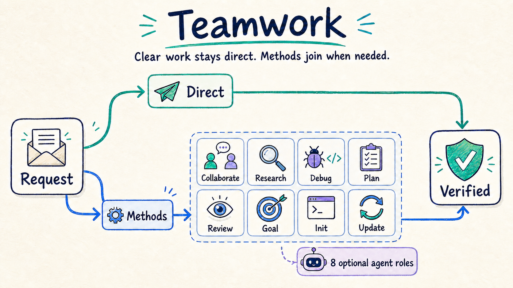
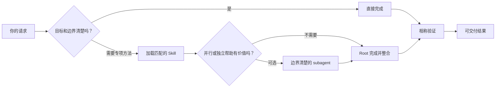

<p align="center">
  
</p>

<h1 align="center">Teamwork</h1>

<p align="center">
  <strong>让 Codex 少一点流程，多一点真正完成。</strong><br>
  清楚、已授权的工作直接做；方向未定、原因未知、需要深研或复查时，再加载恰当的方法。
</p>

<p align="center">
  <a href="https://github.com/JinPLu/Teamwork/releases"></a>
  <a href="LICENSE"></a>
  
  
  
</p>

<p align="center">
  <a href="README.en.md">English</a> ·
  <a href="CHANGELOG.md">更新日志</a> ·
  <a href="CODEX.md">Codex</a> ·
  <a href="docs/architecture.md">架构</a> ·
  <a href="https://github.com/JinPLu/Teamwork/issues">反馈</a>
</p>

---

> [!TIP]
> **你不需要先背会 8 个 Skills。** 大多数时候直接描述结果。只有确实需要一起选方向、深入调研、排查未知原因、制定计划或独立复查时，才点名 Skill：Codex 用 `$teamwork-*`，Cursor / Claude Code 用 `/teamwork-*`。

## 🚀 一分钟开始

克隆仓库并安装 Codex 面：

```bash
git clone https://github.com/JinPLu/Teamwork.git
cd Teamwork
./install.sh codex
```

现在直接说你要的结果：

```text
修改登录超时逻辑，只验证真实受影响路径，成功后停止。
```

目标和改法清楚时，Teamwork 不会先制造 workflow、项目记录或 readiness 门。想先共同判断方向，再这样说：

```text
用 $teamwork-collaborate 比较同步、排队和混合三种方案，先给建议，再问真正会改变选择的问题。
```

## ✨ 为什么用 Teamwork

| | 你得到什么 | 实际体验 |
| --- | --- | --- |
| ⚡ | **清楚工作直接做** | 普通修改、文件阅读、窄查询和已知原因修复不需要流程前置。 |
| 🧭 | **你的边界一直有效** | “继续执行”不会把 Agent 自己写进计划或交接的 SHA-256、回执、审计测试等机制变成你的要求。 |
| 🧰 | **方法按需加入** | 讨论、深研、排错、计划、复查和持续推进各自只在匹配请求时出现。 |
| 🤝 | **subagent 是可选协作者** | 只有并行或独立工作真的有价值时才分派；缺少可选角色不会卡住普通工作。 |
| ✅ | **完成以真实结果为准** | 验证与实际声明相称，不用版本、marker 或测试数量代替结果本身。 |

## 🛣️ 工作如何流动


```mermaid
flowchart LR
    R["你的请求"] --> C{"目标和边界清楚吗？"}
    C -->|"是"| D["直接完成"]
    C -->|"需要专项方法"| S["加载匹配的 Skill"]
    S --> A{"并行或独立帮助有价值吗？"}
    A -->|"可选"| G["边界清楚的 subagent"]
    A -->|"不需要"| I["Root 完成并整合"]
    G --> I
    D --> V["相称验证"]
    I --> V
    V --> O["可交付结果"]
```

没有 Router、固定阶段链或自动 Update 绕路。Root 始终负责用户沟通、集成与最终结果。

## 🧭 当前缺什么，就用什么

| 你当前缺少 | Skill | 它带来的结果 |
| --- | --- | --- |
| 💬 一个可接受的方向 | `$teamwork-collaborate` | 比较选项与权衡，收敛到你愿意采用的方向。 |
| 🔎 深入的外部证据 | `$teamwork-research` | 跨官方资料、论文和可靠来源综合主张、矛盾与结论。 |
| 🐞 未知原因的失败 | `$teamwork-debug` | 从真实失败定位原因，再在已有授权内做窄修复。 |
| 📝 可执行步骤 | `$teamwork-plan` | 把已选方向变成目标、依赖、验证与停止条件清楚的计划。 |
| ✅ 对稳定候选的判断 | `$teamwork-review` | 阅读实际代码、文档、计划或产物，给出有证据的 verdict。 |
| 🎯 持续推进到成功信号 | `$teamwork-goal` | 仅在你明确要求时，持续到验证成功或出现真实阻塞。 |
| 🧰 新项目的轻量说明 | `$teamwork-init` | 只维护一个简短、幂等的 `AGENTS.md` managed block。 |
| 🔄 检查或刷新安装 | `$teamwork-update` | 默认只刷新 Codex 的 Teamwork 安装面。 |

## 🤝 8 个可选 Agent 角色

Researcher、Explorer、Debugger、Challenger、Planner、Reviewer、Worker 和 Writer 都是边界化帮助者，不是必须经过的流水线。
<!-- BEGIN GENERATED: host-counts-zh -->
Claude Code 安装 7 个角色并使用宿主自带 Explore；Cursor 安装 6 个角色（省略 Explorer 与 Debugger），且不安装 Debug / Goal Skill，未知原因诊断使用宿主 Debug；Codex 仍保留 Explorer，以及 Debug、Goal 和 Debugger。
<!-- END GENERATED: host-counts-zh -->
Writer 是低成本、可跨 Skill 复用的非阻塞记录者：它把方法 owner 确认的变化写成 `docs/teamwork/<kind>/` 下的可读 Markdown，不替 owner 改变事实、决定或结论。Root 负责检查点落盘，Writer 只在不耽误写入时帮忙；写不了就报告路径和未交付，但不撤销已经完成的结果。

- Root 只在并行调查、独立判断或清楚分工确实有用时分派。
- handoff 带上目标、负责范围、已确定约束、已有证据和期望返回。
- Reviewer 保持只读，不修复自己的发现；Writer 失败不阻塞主要工作，Root 仍负责确认进入主线的结果。
- Teamwork 子任务默认使用 Standard。父任务启用 Fast 不会自动提高所有子任务的费用，除非你明确要求子任务也加速。
- Cursor 与 Claude 若同时装有同名 Skill 副本，谁被读到未保证；安装时两边同步刷新。

## 🗃️ 七类可读文档

<!-- BEGIN GENERATED: persistence-zh -->
当原生交互或专项方法到达可复用语义结果、且你已经接受该结果时，Root 在同一响应周期把纯 Markdown 写入 `docs/teamwork/<kind>/`；进入 mode 或调用宿主界面本身不会落盘，也不必先点名 Skill。Writer 只在不耽误写入时帮忙。每份文档同时保留一份**当前综合**和按时间追加的**历史**，既方便快速阅读，也不会抹掉结论如何变化。默认路径为 `docs/teamwork/<kind>/<slug>.md`，同一稳定身份复用已有路径。

| 文档 | 它记录什么 |
| --- | --- |
| 💬 Discussion | 选项、权衡、已定选择与仍待决定的问题。 |
| 🔎 Research | 外部证据、矛盾、综合结论、置信度与停止依据。 |
| 🐞 Debug | 失败边界、假设、根因、修复与同路径验证。 |
| 📝 Plan | 已选方向的步骤、owner、依赖、验证与停止条件。 |
| ✅ Review | 稳定候选、直接证据、发现与 verdict。 |
| 📌 Report | Goal、Init、Update 或执行工作的状态、结果与阻塞。 |
| 🧪 Experiment | 冻结声明、贡献格、裁定与结果或墓碑。 |
<!-- END GENERATED: persistence-zh -->

跨 Skill 复用 Writer 只复用同一个 Agent 生命周期，不让一个 Skill 接管另一个 Skill 的语义。文档不依赖 Case、schema、JSON index、迁移或 readiness；没有可复用变化时，也不必为流程而创建文档。

## 📋 可直接复制的请求

```text
# 一起选择方向
用 $teamwork-collaborate 比较三个 onboarding 方向，推荐一个，并只问真正影响选择的问题。

# 深入调研
用 $teamwork-research 查官方资料和关键论文，处理矛盾证据并给出可追溯结论。

# 排查未知原因
用 $teamwork-debug 复现这个 CI 失败，确认根因后再做最小修复并验证同一路径。

# 制定执行计划
用 $teamwork-plan 把已确定的迁移方向拆成目标、owner、依赖、验证和停止条件，不要执行。

# 独立复查
用 $teamwork-review 检查这个 diff 是否满足需求，重点寻找假成功、遗漏路径和过期说明。

# 持续到完成
用 $teamwork-goal 继续修到指定检查通过；只有出现真实阻塞才停。
```

## 🔄 更新与项目设置

刷新本机安装：

```bash
./install.sh update
```

或在新的 Codex 任务中运行 `$teamwork-update`。

若你之前用过 Codex Marketplace 插件，先卸掉插件再改走 checkout 安装：

```bash
codex plugin remove teamwork-skill
./install.sh codex
```

如果只想给一个项目加入轻量 Teamwork 说明：

```bash
./install.sh --project-root /absolute/project/path init-project
```

它只添加或刷新一个 `AGENTS.md` managed block，不创建 Case、索引、schema、迁移状态或项目运行时。

<details>
<summary><strong>开发 checkout、兼容适配器与验证</strong></summary>

```bash
git clone https://github.com/JinPLu/Teamwork.git
cd Teamwork
./install.sh --help
./scripts/validate.sh
./scripts/check-update.sh --readiness
```

Codex 是正式支持与 release-qualified 的运行面（Skill 调用用 `$name`）。Cursor 和 Claude Code 适配器保留用于显式兼容开发（Skill 调用用 `/name`），不参与 Codex readiness，也不会阻塞普通工作。双根 Skill 副本并存时谁赢未保证，安装时两边同步。

`./scripts/validate.sh` 运行快速核心 smoke；显式发布准备使用 `./scripts/validate.sh --release`。readiness 只报告安装状态，不授权或阻止其他任务。

</details>

## 📚 继续了解

- [更新日志](CHANGELOG.md)：每个版本真正改变了什么。
- [Codex 指南](CODEX.md)：安装、配置和排错。
- [架构](docs/architecture.md)：原生路径、Skills、Agent 与安装面的边界。
- [参与贡献](CONTRIBUTING.md)：canonical owners 与验证命令。
- [Cursor](CURSOR.md) / [Claude Code](CLAUDE.md)：兼容开发适配器。

许可证：[MIT](LICENSE)
