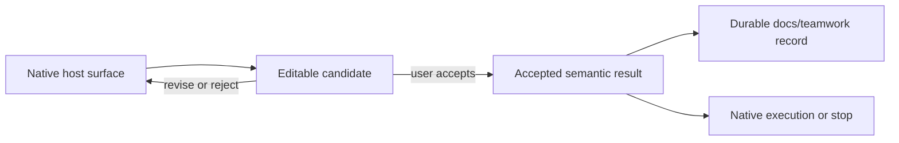

# Teamwork Architecture

Teamwork is a small collection of optional methods around native work.

## Runtime flow

1. Root reads the user's request and the repository instructions.
2. Clear authorized work stays native.
3. A named Skill is loaded only when its public trigger matches.
4. Root may delegate a bounded, independent subtask when doing so is useful.
5. Root integrates the result, performs the authorized work, and verifies the
   outcome in proportion to the claim.

There is no router, mandatory stage chain, readiness preflight, document schema,
Case lifecycle, JSON index, migration gate, or automatic Update detour.

## Source ownership

| Surface | Owns | Does not own |
| --- | --- | --- |
| `policy/teamwork-global.md` | universal authorization, checkpoint and write contract, Writer fallback, quote separation | host tool names, per-Skill checkpoints |
| `skills/*/SKILL.md` | method, identity, checkpoints, template path, write timing | generic delegation, Writer contract |
| `skills/*/references/*.md` | fill slots | teaching prose |
| `CURSOR.md` / `CLAUDE.md` / `CODEX.md` | host install, roles, accept signals, permission facts | universal write contract |
| `README.md` / `README.en.md` | user-visible outcomes | mechanism restatement |

`policy/teamwork-global.md` is the sole owner of universal authorization and
mechanism rules.

## Native interaction and documents

Native host interaction stays in charge: plan UI, question UI, debug, and
approval remain host surfaces. The path is native interaction → accepted
semantic result → durable record.

After acceptance, `docs/teamwork/` is the cross-session semantic owner; the
host surface remains the live editing and execution surface. A later accepted
material delta updates the same stable identity and appends History. Added
acceptance checks or parallel concerns do not open a new plan. When the two
surfaces diverge, the latest user-accepted semantic delta wins; do not merge
by file timestamp.

Answers that serve an active result merge into that result. Only an independent
reusable preference decision gets a separate discussion identity. Ordinary
local investigation that serves a plan stays in that plan. Init does not
create `docs/teamwork/`; the first checkpoint creates those paths.

One Writer may serve several Skills during its lifetime. That reuse is only
Agent-lifecycle reuse: Discussion, Research, Debug, Plan, Review, and Report
retain separate semantic owners and cannot certify changes for one another.
Writer may clarify placement, deduplicate, and compress only literally.

Each document is plain Markdown under `docs/teamwork/` with a concise current
synthesis and an append-only chronological history. Default paths use
`docs/teamwork/<kind>/<YYYY-MM-DD>-<slug>.md` and reuse the path for the same
stable identity. The six meanings are:

- Discussion (`discussions/`): options, trade-offs, settled choices, and open
  decisions;
- Research (`research/`): external evidence, contradictions, synthesis,
  confidence, and stop basis;
- Debug (`debug/`): failure boundary, hypotheses, causal evidence, repair, and
  same-path verification;
- Plan (`plans/`): executable steps, owners, dependencies, verification, and
  stop conditions for a selected direction;
- Review (`reviews/`): stable candidate, direct evidence, findings, and
  verdict;
- Report (`reports/`): reusable status, outcomes, and blockers from
  persistence, setup, update, or execution work.

A document is created or updated at Skill-defined semantic checkpoints, never
as a precondition for native work.

## Agent handoff

Every handoff uses the same five fields:

- objective;
- owned scope;
- settled user constraints;
- available evidence;
- requested return.

Researcher, Explorer, Debugger, Challenger, Planner, Reviewer, Worker, and
Writer are focused helpers. Claude Code installs 7 roles and omits Explorer
because that host already provides Explore. Cursor installs 6 roles and omits
Explorer and Debugger, and does not install the Debug or Goal Skills; unknown-cause
diagnosis uses host Debug. Codex retains the Explorer role, plus Debug, Goal,
and Debugger.
Helpers do not own the user dialogue. Missing agents do not block native work.
When the user specifically requires an independent review and no independent
context is available, Root labels the review non-independent instead of
pretending otherwise.

## Sources and installation

- `skills/` owns behavior.
- `templates/*-agents/` owns optional host agent profiles.
- `scripts/install/` owns installation mechanics.
- `plugins/teamwork-skill/` is generated from canonical sources.

The default install and Update path is Codex-only. Cursor and Claude Code remain
explicit compatibility targets.

## Verification

The default validation command checks syntax, Skill metadata, Codex profiles,
project initialization, and bundle synchronization. Release-only version and
packaging checks run only with `--release`. Tests and markers never substitute
for reading the actual result.
