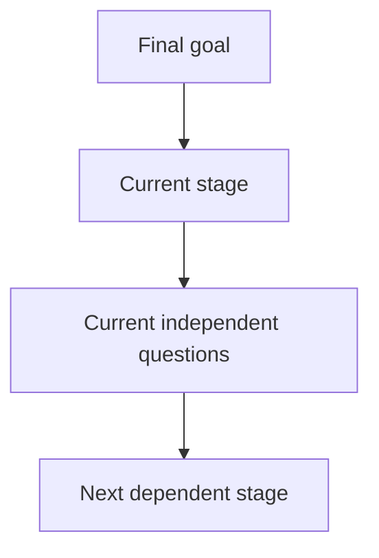

# Discussion: <subject>

## Identity and final goal

- Subject identity: <stable identity>
- Final goal: <owner-certified goal>
- Authoritative owner: <owner>

## Decision map

## Current stage

<stage and settled context>

## Current question batch

<all independent valuable questions for this stage; no fixed count>

## Options and recommendation

<meaningfully different options and owner-certified recommendation>

## Decisions and open points

<user decisions, unresolved points, and next authorized action>

## History

<Append only. Never rewrite or remove an existing entry; a correction or
reversal is a new dated entry.>

### <date/time — semantic change>

<decision or synthesis delta>
