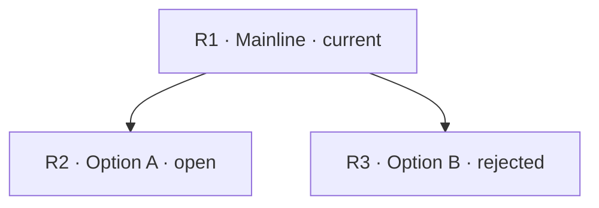

Artifact Type: discussion
Status: active
Authority: supporting
Last Updated: YYYY-MM-DD
Search Keys: <goal, decision terms, components, identifiers>
Abstract: <mainline, current decision, and applicability boundary>
Linked Artifacts: <paths or none>

# Teamwork Discussion

This artifact supports continuity for a long, cross-context, handoff-sensitive,
or materially branching Grill. It is not a transcript and grants no execution
authority.

## Starting Question

- Mainline or project goal: <path or plain-language anchor>
- Decision: <what is being decided>
- Why now: <why this decision can change the mainline>

## Decision State

- Decisions: <resolved choices and why>
- Open: <unresolved material options or none>
- Rejected: <discarded options and why, or none>
- Evidence: <decision-relevant sources and observations>
- Resume point: <the next decision question and why it can change the mainline>
- Promotion: <none, or target artifact/path and trigger>

## Route Map (Optional)

Use a diagram when branching relationships are easier to recover visually. Use
artifact-local node keys such as `R1`, include textual status in every node, and
keep evidence and outcomes in Decision State rather than duplicating them here.

## Resume Summary (Optional)

Use this instead of a Route Map when a short plain-text orientation is clearer:
what was decided, what remains open or rejected, the evidence that matters, and
the exact point at which to resume. Do not reproduce dialogue or a raw transcript.

## Update Rules

Update only at a material checkpoint: a decision changes or closes a branch,
evidence materially changes a route, the mainline changes, continuity is about
to cross a context or handoff boundary, or the discussion is promoted or
superseded. Do not update per turn. Store decision-relevant, privacy-safe
summaries only; exclude raw transcripts, hidden reasoning, secrets, and
unnecessary personal data. Promotion does not grant execution authority.
