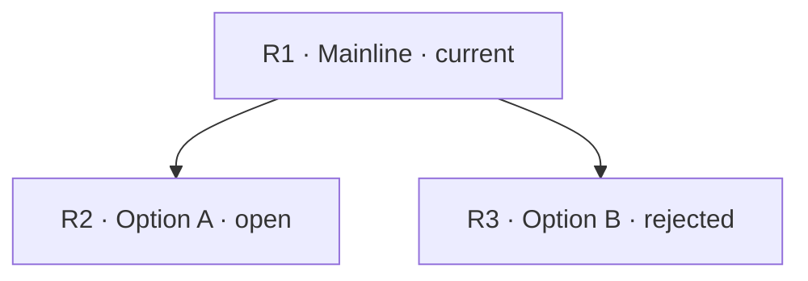

Artifact Type: discussion
Status: active
Authority: supporting
Last Updated: YYYY-MM-DD
Search Keys: <goal, decision terms, components, identifiers>
Abstract: <mainline, current decision, and applicability boundary>
Linked Artifacts: <paths or none>

# Teamwork Discussion

This artifact supports continuity for a long, cross-context, handoff-sensitive,
or materially branching Grill. It is not a transcript and grants no execution
authority.

## Starting Question

- Mainline or project goal: <path or plain-language anchor>
- Decision: <what is being decided>
- Why now: <why this decision can change the mainline>

## Route Map

Use artifact-local node keys such as `R1`; do not reuse issue, task, or external
system identifiers as node keys. Put a textual status in every node so meaning
does not depend on color.

## Route Notes

Route Notes are the sole owner of each node's evidence, outcome, reason, and
mainline impact. Keep one keyed entry per Route Map node and do not duplicate
these fields elsewhere in the artifact.

### R1 — <short label>

- Status: current
- Evidence: <decision-relevant evidence or none>
- Outcome: <current result or unresolved>
- Reason: <why this route remains, changed, or closed>
- Mainline impact: <how this affects the global goal>

### R2 — <open option label>

- Status: open
- Evidence: <decision-relevant evidence or none>
- Outcome: unresolved
- Reason: <why this option remains open>
- Mainline impact: <how choosing it could affect the global goal>

### R3 — <rejected option label>

- Status: rejected
- Evidence: <decision-relevant evidence or none>
- Outcome: <why this option was rejected>
- Reason: <why the discussion no longer follows this route>
- Mainline impact: <how rejecting it narrows the global decision>

## Playback

<A concise plain-text orientation for the next reader: what is being decided,
what has already been ruled in or out, and where to resume. Summarize decisions;
do not reproduce dialogue or a raw transcript.>

## Continuity

- Current: <current decision and route key>
- Open: <unresolved material branches by route key, or none>
- Next: <the next decision question and why it can change the mainline>
- Promotion: <none, or target artifact/path and trigger>

## Update Rules

Update only at a material checkpoint: a decision changes or closes a branch,
evidence materially changes a route, the mainline changes, continuity is about
to cross a context or handoff boundary, or the discussion is promoted or
superseded. Do not update per turn. Store decision-relevant, privacy-safe
summaries only; exclude raw transcripts, hidden reasoning, secrets, and
unnecessary personal data. Promotion does not grant execution authority.
